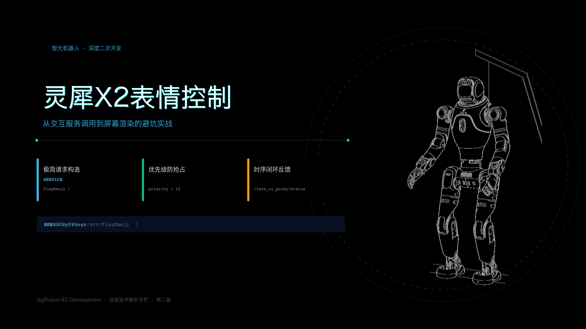
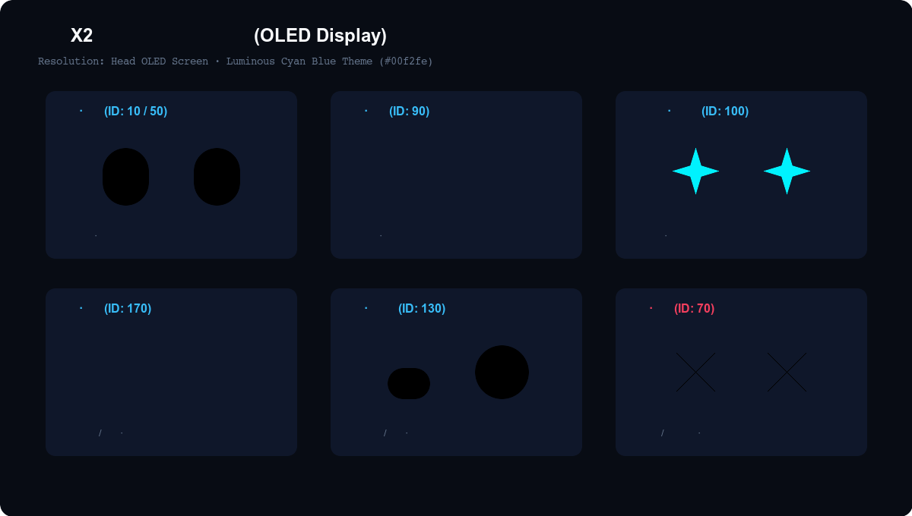

# 灵犀 X2 的表情控制：从交互服务到屏幕渲染



> **官方参考与资源**：
> - 智元 AimDK 官方文档与资源包下载地址：[https://x2-aimdk.agibot.com/zh-cn/latest/index.html](https://x2-aimdk.agibot.com/zh-cn/latest/index.html)
> - 适用 SDK 版本：`v1.0.0`
> - **图片版权与来源声明**：封面机体形象来源于官方 SDK 资源；表情几何效果示意图为本文配合接口参数原创绘制。

---

## 目录
- [一、 为什么先学表情控制？](#一-为什么先学表情控制)
- [二、 灵犀 X2 头部屏表情效果直观呈现](#二-灵犀-x2-头部屏表情效果直观呈现)
- [三、 关键代码：如何用 ROS 2 控制表情？](#三-关键代码如何用-ros-2-控制表情)
  - [3.1 C++ 极简调用范式](#31-c-极简调用范式)
  - [3.2 Python 极简调用范式](#32-python-极简调用范式)
- [四、 必看的工程调用提示与踩坑清单](#四-必看的工程调用提示与踩坑清单)
  - [4.1 避坑第一条：别去读 header.code，直接读 success](#41-避坑第一条别去读-headercode直接读-success)
  - [4.2 避坑第二条：为什么刚发的表情会被立刻刷掉？（优先级设定）](#42-避坑第二条为什么刚发的表情会被立刻刷掉优先级设定)
  - [4.3 进阶实操：单次播放 vs 循环驻留](#43-进阶实操单次播放-vs-循环驻留)
  - [4.4 状态闭环：监听剩余时间与动作音效对齐](#44-状态闭环监听剩余时间与动作音效对齐)
- [五、 附录：灵犀 X2 预设表情编码（emotion_id）速查表](#五-附录灵犀-x2-预设表情编码emotion_id速查表)

---

## 一、 为什么先学表情控制？

在人形机器人的所有功能里，头部屏幕的表情系统是唯一一个**完全与运动动力学解耦**的模块。

当你写腿部走跑或手臂逆解算法时，只要参数传错，机器人就可能发生抖动甚至摔倒；但屏幕控制不同，它只负责在头部的 OLED 显示屏上渲染动画。即便你传错了表情 ID、忘记发心跳或者网络发生丢包，机器人底盘依然安然无恙。

因此，把表情控制作为二次开发环境配通后的第一个实操项目，成本最低、反馈最快，也最适合拿来验证 ROS 2 的跨板通信状态。

---

## 二、 灵犀 X2 头部屏表情效果直观呈现

灵犀 X2 的头部前视区域集成了一块高对比度 OLED 显示屏，官方内置的表情以“**科技青蓝发光几何眼睛**”为主视觉符号。

整个视觉系统通过眼睛弧度、形状缩放以及动态粒子，传达出机器人的当前意图与情绪状态：



1. **平静·注视（ID: 10 / 50）**：默认待机状态。双眼呈现饱满的圆角胶囊形态，伴随低频的自然眨眼动作。
2. **快乐·笑眼（ID: 90）**：交互积极反馈。双眼弯成两道向上的月牙形弧光，常用于打招呼或语音识别成功响应。
3. **加倍开心·星星眼（ID: 100）**：狂喜或深度赞许。眼球中心绽放出高亮的多角星芒，表达热烈情绪。
4. **思考·流转（ID: 170）**：大模型推理中。双眼切换为虚线旋转光环，清晰提示用户“系统正在处理、请稍候”。
5. **疑惑·高低眉（ID: 130）**：语音识别置信度不足或指令不明确时触发。一侧眼睛放大微挑，呈现生动的困惑神情。
6. **异常·告警（ID: 70）**：电机过温、触觉碰撞或系统报障。屏幕色调转为警示红，双眼呈现双叉“X”形态。

---

## 三、 关键代码：如何用 ROS 2 控制表情？

灵犀 X2 将表情播放统一挂载在 ROS 2 Service 上：
- 服务路径：`/aimdk_5Fmsgs/srv/PlayEmoji`（或内部别名 `/face_ui_proxy/play_emoji`）
- 数据类型：`aimdk_msgs/srv/PlayEmoji`

抛开外壳代码，控制表情本质上就是**三行核心逻辑**：填充表情编号、设定播放模式、指定调用优先级。

### 3.1 C++ 极简调用范式

```cpp
#include "aimdk_msgs/srv/play_emoji.hpp"
#include "rclcpp/rclcpp.hpp"

// 构造请求
auto request = std::make_shared<aimdk_msgs::srv::PlayEmoji::Request>();
request->emotion_id = 90; // 表情ID：90 表示开心笑眼
request->mode = 1;       // 播放模式：1 表示单次播放后恢复
request->priority = 15;  // 优先级：建议填 15（高于系统后台 task_manager 的 10）

// 异步发送并带 250ms 超时判定
request->header.header.stamp = node->now();
auto future = client->async_send_request(request);

if (rclcpp::spin_until_future_complete(node, future, std::chrono::milliseconds(250)) == 
    rclcpp::FutureReturnCode::SUCCESS) {
    auto res = future.get();
    // ⚠️ 重点：直接判断 res->success，不要读取 res->header
    if (res->success) {
        RCLCPP_INFO(node->get_logger(), "表情切换成功！");
    }
}
```

### 3.2 Python 极简调用范式

```python
from aimdk_msgs.srv import PlayEmoji
import rclpy

# 构造请求对象
req = PlayEmoji.Request()
req.emotion_id = 170  # 表情ID：170 表示思考流转
req.mode = 2          # 播放模式：2 表示持续循环播放
req.priority = 15     # 优先级：设定为 15，防后台抢占
req.header.header.stamp = node.get_clock().now().to_msg()

# 异步调用
future = client.call_async(req)
rclpy.spin_until_future_complete(node, future, timeout_sec=0.25)

if future.done() and future.result().success:
    node.get_logger().info("表情已更新为思考状态")
```

---

## 四、 必看的工程调用提示与踩坑清单

在真实机器人上调试屏幕时，官方文档里隐藏了几个非常容易踩空的细节。掌握以下四条提示，可以省下很多排查时间：

### 4.1 避坑第一条：别去读 header.code，直接读 success
在常规的 ROS 2 服务开发中，很多开发者习惯通过 `response.header.status.value` 或 `response.header.code` 判断执行结果。
**在灵犀 X2 的 PlayEmoji 服务里，底层返回的 `header` 字段目前未实际启用**，它的 `code` 永远是 0、`status` 永远返回 `UNKNOWN`。
正确的做法是：**直接判断外层的 `response.success` 布尔值**。只要为 `true`，就代表请求已被屏幕渲染引擎接收。

### 4.2 避坑第二条：为什么刚发的表情会被立刻刷掉？（优先级设定）
这是二开新手最常遇到的困惑：代码明明调用成功了，屏幕也闪了一下，但一秒钟不到又被切回了原来的表情。

这是因为机器人底层运行着系统的 `task_manager` 和 `interaction_slave` 进程。这些后台模块会监控开机状态、故障警报以及手柄事件，它们也在向屏幕发送表情，并且使用的内部优先级在 **8 到 10** 之间。

> **调用法则**：  
> 二开代码中的 `priority` 字段，**建议直接填 15（或 20）**。  
> 只要你的优先级大于 10，底层的表情管理器就会判定你的指令属于更高优先权，不会被日常的系统后台任务强行顶掉。

### 4.3 进阶实操：单次播放 vs 循环驻留
字段 `mode` 支持两种取值：
- **`mode = 1`（单次播放）**：动画播放完整一遍后，屏幕会自动淡出并切回原本的待机眨眼表情。适用于打招呼、受到触摸后的即时笑眼反馈。
- **`mode = 2`（循环播放）**：动画会持续循环播放，直到你发送了新的表情指令，或者更高级别的故障报警介入。适用于长时间思考等待、持续充电等状态。

### 4.4 状态闭环：监听剩余时间与动作音效对齐
如果你希望实现“等表情播完、再开始让手臂动作归位”的时序联动，不要在客户端写死 `sleep()`。

你可以订阅表情状态话题：
- **话题名称**：`/face_ui_proxy/status`
- **消息类型**：`FaceEmojiStatus`

该话题在播放期间会以 1Hz 频率推送当前进度：
- 观察字段 `time_to_end_ms`：获取当前表情剩余的播放毫秒数；
- 观察字段 `e_id`：确认当前屏幕上真正显示的是不是你刚下发的表情编号；
- 观察字段 `trace_id`：判断当前屏幕状态是否被其他模块意外抢占。

---

## 五、 附录：灵犀 X2 预设表情编码（emotion_id）速查表

在编写业务逻辑时，可直接对照以下官方枚举表设定 `emotion_id`：

| 表情 ID | 表情官方命名 | 动作与视觉特点 | 推荐应用场景 |
| :---: | :--- | :--- | :--- |
| **1** | 眨眼 (`BLINK`) | 双眼轻微闭合后张开 | 系统自然待机 |
| **10** | 平静-眼神变化 1 | 胶囊眼微幅转动 | 待机巡检 |
| **11** | 平静-眼神变化 2 | 胶囊眼视线微调 | 待机巡检 |
| **20** | 平静-游戏 | 趣味几何形态变化 | 娱乐演示 |
| **30 ~ 33**| 平静-卖萌系列 | 带有弹性形变的俏皮眼睛 | 迎宾互动、近距离陪伴 |
| **40** | 闭上眼 (`EYE_CLOSE`) | 彻底闭眼水平横线 | 休眠待机、准备关机 |
| **50** | 睁开眼 (`EYE_OPEN`) | 从闭眼渐变睁大 | 开机就绪、被唤醒 |
| **60** | 无聊 (`BORING`) | 眼角下垂松垮态 | 长时间未检测到人脸 |
| **70** | 异常 (`ABNORMAL`) | 双叉或警示符号 | 系统报障、传感器异常 |
| **80** | 睡着 (`SLEEPY`) | 闭眼并伴随呼吸微光 | 待机低功耗模式 |
| **90** | 快乐 (`HAPPY`) | 月牙笑弧形态 | 识别成功、收到正面夸奖 |
| **100** | 加倍开心 | 双眼星芒闪耀 | 任务顺利完成、庆贺 |
| **101** | 狂喜 | 高速高光动感笑眼 | 极度兴奋、跳舞互动 |
| **110** | 悲伤 (`SAD`) | 八字下垂眼 | 任务失败、即将断电 |
| **120** | 同情 (`SYMPATHY`) | 柔和微蹙眼 | 情感陪伴 |
| **130** | 疑惑 (`CONFUSE`) | 高低眉不对称形态 | 听不懂提问、意图不清 |
| **140** | 震惊 (`SHOCK`) | 瞳孔急剧扩大高亮 | 突发异物靠近、阻挡 |
| **150** | 撒娇 (`ACTCUTE`) | 弯眼伴随动态微闪 | 亲和互动 |
| **160** | 严肃 (`SERIOUS`) | 紧绷方正几何眼 | 开启避障、巡航作业 |
| **170** | 思考 (`THINKING`) | 双眼旋转流光环 | 大模型生成回答中 |
| **180** | 愤怒 (`ANGRY`) | 倾斜倒八字凌厉眉眼 | 触碰危险禁区 |
| **190** | 加倍愤怒 | 剧烈闪烁凌厉眼 | 严重违规操作提示 |
| **200** | 崇拜 (`ADORE`) | 桃心或光芒聚焦点 | 情感互动反馈 |
| **210** | 加倍崇拜 | 强高光聚焦 | 深度情感互动 |
| **220** | 充电 (`CHARGE`) | 电池电量条与充电动效 | 靠上充电桩、补电中 |

---
*本文档为灵犀 X2 机器人二次开发系列专栏第二篇。下一篇我们将探讨：《灵犀 X2 的预设动作控制：上肢与全身离散动作调度》。*
