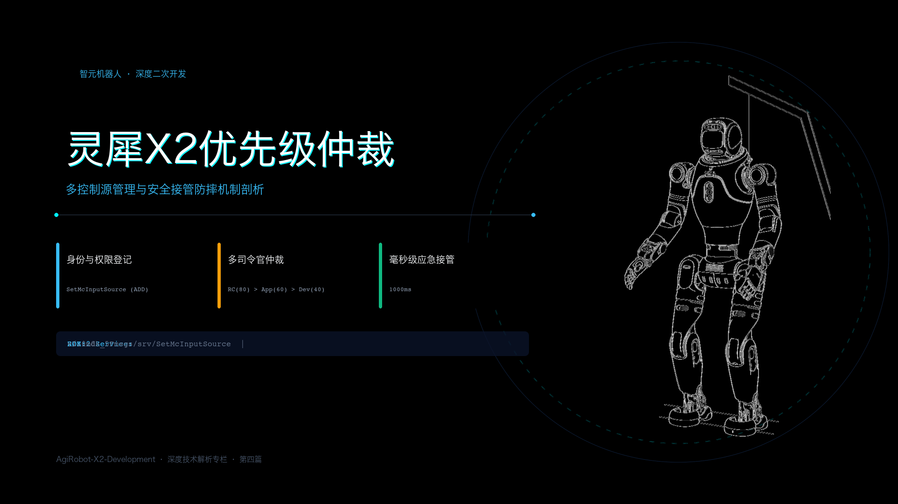
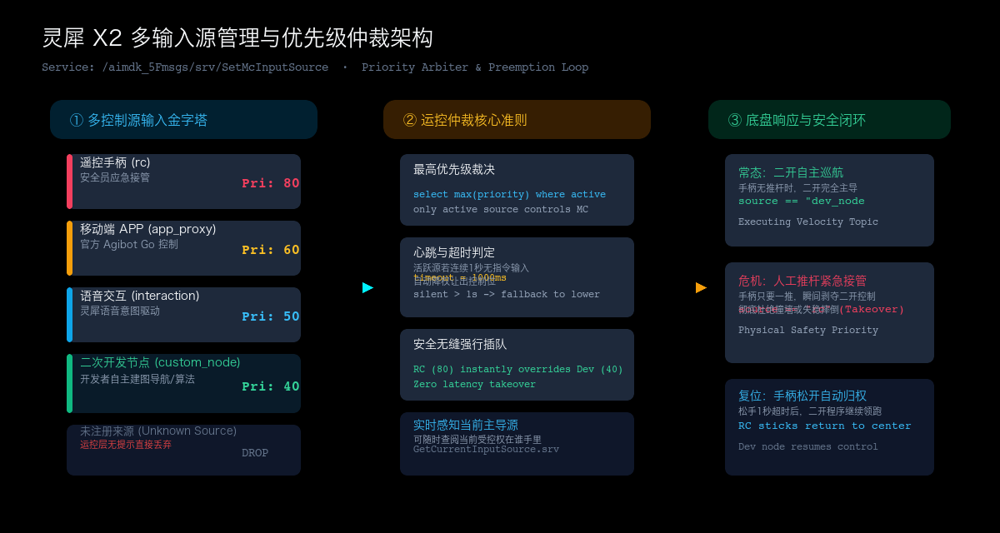

# 灵犀 X2 的控制中枢：多输入源与优先级仲裁机制



> **官方参考与资源**：
> - 智元 AimDK 官方文档与资源包下载地址：[https://x2-aimdk.agibot.com/zh-cn/latest/index.html](https://x2-aimdk.agibot.com/zh-cn/latest/index.html)
> - 适用 SDK 版本：`v1.0.0`
> - **图片版权与来源声明**：封面机体形象来源于官方 SDK 资源；多控制源输入与优先级仲裁架构拓扑图为本文结合系统机制原创绘制。

---

## 目录
- [一、 为什么你的控制指令发出去，机器人却假装听不见？](#一-为什么你的控制指令发出去机器人却假装听不见)
- [二、 输入源仲裁模型：机器人究竟听谁的？](#二-输入源仲裁模型机器人究竟听谁的)
- [三、 关键代码：向系统登记“我是谁”](#三-关键代码向系统登记我是谁)
  - [3.1 C++ 极简注册范式](#31-c-极简注册范式)
  - [3.2 Python 极简注册范式](#32-python-极简注册范式)
- [四、 必看的工程调用提示与避坑清单](#四-必看的工程调用提示与避坑清单)
  - [4.1 避坑第一条：严禁使用系统既有同名来源](#41-避坑第一条严禁使用系统既有同名来源)
  - [4.2 避坑第二条：二开优先级推荐区间（为什么设 40？）](#42-避坑第二条二开优先级推荐区间为什么设-40)
  - [4.3 进阶实战：1000ms 心跳超时与手柄防摔安全接管闭环](#43-进阶实战1000ms-心跳超时与手柄防摔安全接管闭环)
  - [4.4 状态感知：怎么查当前底盘由谁在掌控？](#44-状态感知怎么查当前底盘由谁在掌控)
- [五、 附录：输入源操作类型与内置优先级速查表](#五-附录输入源操作类型与内置优先级速查表)

---

## 一、 为什么你的控制指令发出去，机器人却假装听不见？

很多开发者在搞定网络连接和依赖编译后，兴致冲冲写好代码往走跑速度话题 `/aima/mc/locomotion/velocity` 发指令，结果发现机器人稳如泰山、纹丝不动。

终端里没有报错，ROS 2 话题也在持续发布，但运控底层就是不走。

很多人第一反应是怀疑网络连通性、或者怀疑电机没使能。但真正的根因往往非常隐蔽：**你的控制指令被运控底层直接静默丢弃（Drop）了**。

灵犀 X2 不是一台只有单一程序的轮式小车。它在开机的那一刻起，机体内部就已经同时跑着好几个“指挥官”：
- 抓在安全员手里的 **PS5 遥控手柄（rc）**；
- 手机端连接的 **Agibot Go App（app_proxy）**；
- 头部负责语音听觉的 **灵犀交互模块（interaction）**；
- 机载自主导航系统的 **路径规划器（pnc）**。

如果运控底层不对这些指令做裁决，遥控器想往左、导航算法想往前、APP 又点了个停止，几十公斤重的双足机器人瞬间就会因为电机力矩冲突直接失衡摔倒。

为了让多方指令井然有序，灵犀 X2 设计了一套**控制信号输入源管理与动态仲裁体系（MC Control Input Source Arbitration）**。任何程序要想控制机器人移动，都必须先亮出自己的“工作证与权限等级”。

---

## 二、 输入源仲裁模型：机器人究竟听谁的？

运控底层的仲裁逻辑非常纯粹：**全网只听当前优先级最高、且心跳活跃的那个单一输入源**。

整个仲裁拓扑分为三个清晰阶段：**多源接入 $\rightarrow$ 仲裁裁决 $\rightarrow$ 物理底盘响应**。



### 1. 系统内置的五大来源金字塔
在机器人出厂固件中，内置模块已经预先分配好了固定的权限梯队：

1. **遥控手柄（`rc`，优先级 80，超时 1000ms）**：
   位于人工控制的顶点。无论其他算法怎么跑，只要安全员推动手柄摇杆，运控系统无条件瞬时切换到手柄控制，这是实验室调试防摔、防撞墙的最高物理安全底线。
2. **遥操作模块（`vr`，优先级 70，超时 1000ms）**：
   面向 VR 空间全身动捕遥控（预留接口）。
3. **移动端 APP（`app_proxy`，优先级 60，超时 1000ms）**：
   官方手机平板端操控。
4. **灵犀语音交互（`interaction`，优先级 50，超时 1000ms）**：
   语音指令（如“向前走两步”）触发的临时运动。
5. **系统路径规划（`pnc`，优先级 40，超时 1000ms）**：
   自带的自主导航巡航规划模块。

### 2. 仲裁三大铁律
- **铁律一：未注册者，直接丢弃**。如果发布速度指令时，消息头填写的 `source` 从未向系统注册过，运控层当场丢弃该数据帧，不予响应。
- **铁律二：最高权限通吃**。在所有处于发送状态的有效输入源中，只响应优先级数值最大的那个；其余低优先级的指令直接被过滤。
- **铁律三：心跳超时自动交权**。高优先级输入源如果停止发送超过 `timeout` 阈值（默认 1000ms），系统会立刻判定该源“已离线休眠”，控制权顺畅跌落回下一个处于活跃状态的次优先级输入源。

---

## 三、 关键代码：向系统登记“我是谁”

二次开发节点想要获得移动控制权，必须在发速度之前调用 ROS 2 服务：
- 服务路径：`/aimdk_5Fmsgs/srv/SetMcInputSource`
- 数据类型：`aimdk_msgs/srv/SetMcInputSource`

核心步骤只有三项：声明操作类型为 `ADD`、填写自定义源名称、设定优先级与超时时间。

### 3.1 C++ 极简注册范式

```cpp
#include "aimdk_msgs/srv/set_mc_input_source.hpp"
#include "rclcpp/rclcpp.hpp"

// 1. 构造注册请求
auto request = std::make_shared<aimdk_msgs::srv::SetMcInputSource::Request>();
request->action.value = 1001;                 // 操作码：1001 为新增注册 (ADD)
request->input_source.name = "my_auto_nav";   // 二开自定义名称（切勿与系统已有同名）
request->input_source.priority = 40;          // 推荐优先级：40
request->input_source.timeout = 1000;         // 超时心跳门限：1000ms

// 2. 异步发送并带 250ms 超时判定
request->request.header.stamp = node->now();
auto future = client->async_send_request(request);

if (rclcpp::spin_until_future_complete(node, future, std::chrono::milliseconds(250)) == 
    rclcpp::FutureReturnCode::SUCCESS) {
    auto res = future.get();
    if (res->response.header.code == 0) {
        RCLCPP_INFO(node->get_logger(), "输入源 my_auto_nav 注册成功，任务ID: %lu", res->response.task_id);
    } else {
        RCLCPP_WARN(node->get_logger(), "注册失败，错误码: %ld（可能名称已被占用）", res->response.header.code);
    }
}
```

### 3.2 Python 极简注册范式

```python
from aimdk_msgs.srv import SetMcInputSource
from aimdk_msgs.msg import McInputAction, McInputSource
import rclpy

# 构造请求对象
req = SetMcInputSource.Request()
req.action.value = 1001                    # 1001: ADD 注册新源
req.input_source.name = 'my_py_controller' # 标识字符串
req.input_source.priority = 40             # 优先级设定为 40
req.input_source.timeout = 1000            # 超时设为 1000ms
req.request.header.stamp = node.get_clock().now().to_msg()

# 异步调用
future = client.call_async(req)
rclpy.spin_until_future_complete(node, future, timeout_sec=0.25)

if future.done() and future.result().response.header.code == 0:
    node.get_logger().info("输入源注册成功，后续走跑消息请绑定此 source 名称！")
```

---

## 四、 必看的工程调用提示与避坑清单

掌握了输入源注册的代码之后，在实际跑机调试时还有四条极为关键的工程避坑法则：

### 4.1 避坑第一条：严禁使用系统既有同名来源
在定义 `input_source.name` 时，**绝对不要偷懒借用 `rc`、`app_proxy`、`interaction` 或 `pnc` 这几个名字**。

系统内部会对原生模块进行连接鉴权与实例绑定。如果你在二开程序中试图重复 `ADD` 注册一个叫 `"rc"` 的源，底层接口会返回错误码拒绝创建；即使强行修改，也极易打乱遥控器的正常心跳，造成遥控手柄脱机。

> **最佳实践**：取一个带自己项目特性的名字，比如 `'slam_nav_node'`、`'heart_walk'` 或 `'keyboard_teleop'`。

### 4.2 避坑第二条：二开优先级推荐区间（为什么设 40？）
官方给出的优先级总区间是 0 到 100：
- 80 ~ 100：系统级紧急安全控制；
- 60 ~ 79：人工高级接管（手柄、APP）；
- 40 ~ 59：自主交互与路径规划；
- 20 ~ 39：常规试验二开。

**我们强烈建议二开程序设置在 `40` 左右**。
原因非常现实：如果设得太高（比如写成 90），二开程序一旦写出死循环疯狂发速度指令，它会反过来压制住安全员手中的遥控手柄（80）。机器人一旦直冲墙壁或障碍物跑去，安全员推手柄将无法夺回控制权，只能按物理急停按钮！设为 40 既能正常巡航，又能把最高生杀大权留给安全员。

### 4.3 进阶实战：1000ms 心跳超时与手柄防摔安全接管闭环
这里展现了工业级运控系统极具智慧的“人机协作”设计：

1. **常态运行**：  
   二开程序以 20Hz~50Hz 往 `/aima/mc/locomotion/velocity` 发速度指令，消息里的 `source` 填写刚才注册的名字。此时手柄摇杆在中心死区（没有发有效位移），机器人由二开程序稳定领跑。
2. **突发危机**：  
   算法突发漂移即将撞墙，站在一旁的安全员立刻推动手柄摇杆。手柄驱动会立刻以优先级 80 发布指令。80 > 40，运控底层在 **1 毫秒内** 强行切换为手柄指令，二开指令瞬间被屏蔽，机身被人工拉回。
3. **无缝归权**：  
   安全员纠偏后松开手柄摇杆。摇杆归中后手柄停止发送移动流。经过 `1000ms`（超时阈值）后，仲裁器判定手柄已退出，控制权无缝归还给后台的二开程序继续跑。

### 4.4 状态感知：怎么查当前底盘由谁在掌控？
如果你想在程序界面或者日志中实时显示当前机器人的控制权在谁手上，可以调用查询服务：
- 服务路径：`/aimdk_5Fmsgs/srv/GetCurrentInputSource`
- 数据类型：`aimdk_msgs/srv/GetCurrentInputSource`

响应体中的 `input_source.name` 会告诉你当前赢得仲裁的活跃源是谁（比如返回 `"rc"` 说明被手柄抢占，返回你的节点名说明正由算法主导）。
> **注**：刚开机且所有人都没有推杆发速度时，底盘没有任何有效输入，此时查询返回的输入源名称可能为空字符串，属于正常物理表现。

---

## 五、 附录：输入源操作类型与内置优先级速查表

### 1. 输入源管理操作码（McInputAction）
| 操作类型常量 | 取值 (int32) | 说明 | 必须携带的参数 |
| :--- | :---: | :--- | :--- |
| `INPUTACTION_ADD` | **1001** | 注册新增控制源 | `name`, `priority`, `timeout` |
| `INPUTACTION_MODIFY`| **1002** | 运行时动态修改优先级/超时 | `name`, `priority`, `timeout` |
| `INPUTACTION_DELETE`| **1003** | 销毁注销控制源 | `name` |
| `INPUTACTION_ENABLE`| **2001** | 恢复启用先前禁用的源 | `name` |
| `INPUTACTION_DISABLE`| **2002**| 临时挂起禁用某源（指令将被丢弃）| `name` |

### 2. 原厂内置各模块优先级分配基准
| 模块标识 (`source`) | 中文名称与归属 | 默认优先级 | 默认心跳超时 | 核心职责 |
| :--- | :--- | :---: | :---: | :--- |
| `rc` | 遥控手柄 (PS5) | **80** | 1000 ms | 安全员人工接管、防摔急停 |
| `vr` | 遥操控制模块 | **70** | 1000 ms | 远端空间动捕遥控（预留） |
| `app_proxy` | Agibot Go 移动应用 | **60** | 1000 ms | 手机端调姿与交互操控 |
| `interaction` | 智元灵犀交互系统 | **50** | 1000 ms | 语音指令与情景伴随移动 |
| `pnc` | 机载路径规划器 | **40** | 1000 ms | SLAM 导航与自主路径跟踪 |
| *自定义名称* | **二次开发节点** | **20 ~ 40** | 1000 ms | 用户自主编写的巡航与控制算法 |

---
*本文档为灵犀 X2 机器人二次开发系列专栏第四篇。下一篇我们将正式进入核心高动态领域：《灵犀 X2 的连续移动与走跑速度控制》。*
