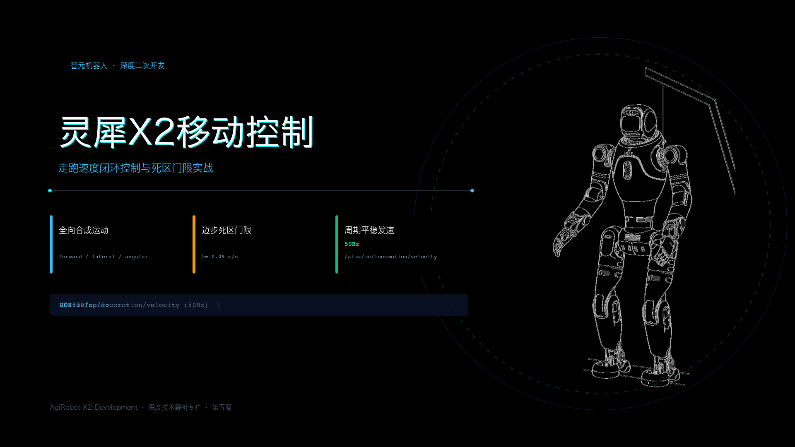
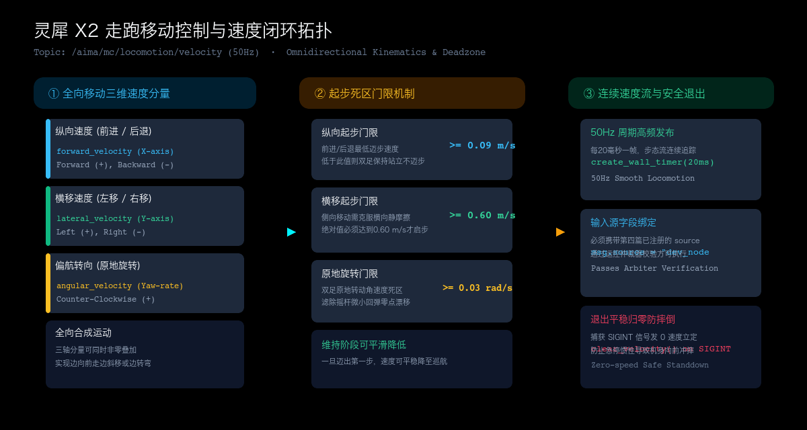

# 灵犀 X2 的连续移动与走跑速度控制



> **官方参考与资源**：
> - 智元 AimDK 官方文档与资源包下载地址：[https://x2-aimdk.agibot.com/zh-cn/latest/index.html](https://x2-aimdk.agibot.com/zh-cn/latest/index.html)
> - 适用 SDK 版本：`v1.0.0`
> - **图片版权与来源声明**：封面机体形象来源于官方 SDK 资源；走跑速度闭环控制与死区门限拓扑图为本文结合系统机制原创绘制。

---

## 目录
- [一、 移动控制为什么必须用 Topic 而不能用 Service？](#一-移动控制为什么必须用-topic-而不能用-service)
- [二、 走跑控制底座：三向速度与物理门限](#二-走跑控制底座三向速度与物理门限)
  - [2.1 三轴全向速度坐标系](#21-三轴全向速度坐标系)
  - [2.2 为什么必须跨过起步门限（Deadzone）？](#22-为什么必须跨过起步门限deadzone)
- [三、 关键代码：让机器人跑起来的最小闭环骨架](#三-关键代码让机器人跑起来的最小闭环骨架)
  - [3.1 C++ 核心范式（定时器高频发速与优雅退出）](#31-c-核心范式定时器高频发速与优雅退出)
  - [3.2 Python 并列对照范式](#32-python-并列对照范式)
- [四、 必看的工程调用提示与避坑清单](#四-必看的工程调用提示与避坑清单)
  - [4.1 避坑第一条：牢记前置条件——底座必须处于 STAND_DEFAULT](#41-避坑第一条牢记前置条件底座必须处于-stand_default)
  - [4.2 避坑第二条：速度突变与加速度限幅（平滑给速）](#42-避坑第二条速度突变与加速度限幅平滑给速)
  - [4.3 进阶实操：手柄随行与 1000ms 心跳保活](#43-进阶实操手柄随行与-1000ms-心跳保活)
  - [4.4 避坑第三条：为什么严禁 Ctrl+C 粗暴强退？](#44-避坑第三条为什么严禁-ctrlc-粗暴强退)
- [五、 附录：走跑控制话题与速度物理极限速查表](#五-附录走跑控制话题与速度物理极限速查表)

---

## 一、 移动控制为什么必须用 Topic 而不能用 Service？

在前几篇中，我们学习模式切换、表情播放以及预设动作时，用的全都是 ROS 2 Service。

Service 是一问一答的配对机制：客户端发个请求，服务端响应确认。对于“切换模式”、“播个表情”这种几秒钟甚至几分钟才触发一次的离散事件，Service 是最稳妥的。

但**走跑移动完全是另一码事**。

双足机器人的行走，是一个高频、连续的动态质心调整过程。如果采用 Service 机制，每迈一步都要走一遍网络握手，一旦局域网发生微秒级的延迟波动，下位机的步态规划器就会发生“指令饥饿”，导致双腿在支撑相和摆动相切换时突然卡顿，机身瞬间失稳。

因此，灵犀 X2 将走跑移动控制严格做成了 **高频发布-订阅的 Topic 机制**：
- 控制话题：`/aima/mc/locomotion/velocity`
- 消息数据结构：`aimdk_msgs/msg/McLocomotionVelocity`
- 推荐发布频率：**20Hz ~ 50Hz**（即每 20ms~50ms 发送一帧速度数据）

客户端只需源源不断地向话题推送最新的目标速度矢量，下位机运控板以毫秒级周期从中读取最新的速度指令，平滑驱动全身 12 个腿部自由度交替踏步。

---

## 二、 走跑控制底座：三向速度与物理门限

很多初学者直接上手写移动代码时，最常遇到的现象是：发了 `0.05 m/s` 的前进速度，机器人纹丝不动；发了 `0.3 m/s`，机器人却迈步开走了。这背后是灵犀 X2 的物理坐标系与死区门限机制。



### 2.1 三轴全向速度坐标系
在消息类型 `McLocomotionVelocity` 中，移动控制由三个双精度浮点数（float64）共同决定：

1. **纵向速度（`forward_velocity`，单位：m/s）**：
   机体 X 轴方向。**正值表示向前迈步**，负值表示倒退迈步。
2. **横移速度（`lateral_velocity`，单位：m/s）**：
   机体 Y 轴方向。**正值表示向左侧移**，负值表示向右侧移。双足机器人具备横向移动能力，无需原地掉头即可平移避障。
3. **偏航转向角速度（`angular_velocity`，单位：rad/s）**：
   绕机体 Z 轴旋转。**正值表示逆时针向左原地自转**，负值表示顺时针向右原地自转。

这三个分量在底层完全解耦且支持全向叠加。例如：`forward=0.3` 且 `angular=0.2` 时，机器人会走出平滑的前向圆弧轨迹；`forward=0.2` 且 `lateral=0.2` 时，机器人则会斜向 45 度滑步推进。

### 2.2 为什么必须跨过起步门限（Deadzone）？
双足机器人由十几块高精度谐波减速器和连杆支撑。如果手柄摇杆产生轻微的机械磨损虚位、或者二开浮点数产生了极微小的数值漂移，运控如果无脑响应，电机就会在高负载下频繁抽动，极易损坏齿轮与轴承。

为了过滤这些微小噪声，并确保机体能克服初始静摩擦启动，灵犀 X2 设定了**初始起步门限（Starting Thresholds）**：

- **纵向起步门限**：绝对值必须达到 **0.09 m/s** 以上；
- **横移起步门限**：绝对值必须达到 **0.60 m/s** 以上；
- **偏航角速度门限**：绝对值必须达到 **0.03 rad/s** 以上。

> **物理规律**：  
> 当机器人处于完全静止时，你下发的初速度必须**跨过上述门限**，步态规划器才会拔腿迈出第一步。  
> 只要第一步迈出、机身进入动态步态循环后，维持阶段就可以平滑下调至更小的巡航速度（例如降到 0.05 m/s 慢慢微调）。

---

## 三、 关键代码：让机器人跑起来的最小闭环骨架

写走跑控制代码，核心结构必须包含四个标准动作：
1. 先向前置服务 `/aimdk_5Fmsgs/srv/SetMcInputSource` 注册二开源（第四篇知识点）；
2. 创建 `/aima/mc/locomotion/velocity` 的 Publisher；
3. 创建 50Hz 定时器（`create_wall_timer(20ms)`）持续发布速度帧；
4. 注册终端中断信号（`SIGINT`），退出时必须自动下发零速度立定。

### 3.1 C++ 核心范式（定时器高频发速与优雅退出）

以下为精炼完整的工程闭环骨架（节选提炼自 `src/examples/src/mc/mc_locomotion_velocity.cpp`）：

```cpp
#include "aimdk_msgs/msg/mc_locomotion_velocity.hpp"
#include "aimdk_msgs/srv/set_mc_input_source.hpp"
#include "rclcpp/rclcpp.hpp"
#include <csignal>

class LocomotionNode : public rclcpp::Node {
public:
  LocomotionNode() : Node("locomotion_node"), vx_(0.3), vy_(0.0), wz_(0.0) {
    // 1. 创建速度发布器与输入源注册客户端
    pub_ = this->create_publisher<aimdk_msgs::msg::McLocomotionVelocity>("/aima/mc/locomotion/velocity", 10);
    cli_ = this->create_client<aimdk_msgs::srv::SetMcInputSource>("/aimdk_5Fmsgs/srv/SetMcInputSource");

    // 2. 注册输入源（名称为 "my_mover"，优先级 40）
    register_source("my_mover", 40);

    // 3. 开启 50Hz (每 20ms) 连续发布循环
    timer_ = this->create_wall_timer(std::chrono::milliseconds(20), [this]() {
      auto msg = aimdk_msgs::msg::McLocomotionVelocity();
      msg.header.stamp = this->now();
      msg.source = "my_mover";         // 必须与注册名称严格一致
      msg.forward_velocity = vx_;      // 前进速度
      msg.lateral_velocity = vy_;      // 横移速度
      msg.angular_velocity = wz_;      // 旋转角速度
      pub_->publish(msg);
    });
  }

  void stop() {
    vx_ = 0.0; vy_ = 0.0; wz_ = 0.0;
    auto msg = aimdk_msgs::msg::McLocomotionVelocity();
    msg.header.stamp = this->now();
    msg.source = "my_mover";
    pub_->publish(msg);
    RCLCPP_INFO(this->get_logger(), "已下发归零速度，机器人平稳立定。");
  }

private:
  void register_source(const std::string& name, int prio) {
    while (!cli_->wait_for_service(std::chrono::seconds(2))) {}
    auto req = std::make_shared<aimdk_msgs::srv::SetMcInputSource::Request>();
    req->action.value = 1001; // ADD
    req->input_source.name = name;
    req->input_source.priority = prio;
    req->input_source.timeout = 1000;
    req->request.header.stamp = this->now();
    cli_->async_send_request(req);
  }

  rclcpp::Publisher<aimdk_msgs::msg::McLocomotionVelocity>::SharedPtr pub_;
  rclcpp::Client<aimdk_msgs::srv::SetMcInputSource>::SharedPtr cli_;
  rclcpp::TimerBase::SharedPtr timer_;
  double vx_, vy_, wz_;
};
```

### 3.2 Python 并列对照范式

```python
import rclpy
from rclpy.node import Node
from aimdk_msgs.msg import McLocomotionVelocity
from aimdk_msgs.srv import SetMcInputSource

class PyMover(Node):
    def __init__(self):
        super().__init__('py_mover')
        self.pub = self.create_publisher(McLocomotionVelocity, '/aima/mc/locomotion/velocity', 10)
        self.cli = self.create_client(SetMcInputSource, '/aimdk_5Fmsgs/srv/SetMcInputSource')
        
        # 注册输入源
        self.register_source('py_mover', 40)
        
        # 挂载 50Hz 周期发布
        self.timer = self.create_timer(0.02, self.publish_velocity)
        self.vx = 0.3 # 0.3 m/s 前进巡航

    def register_source(self, name, priority):
        while not self.cli.wait_for_service(timeout_sec=2.0): pass
        req = SetMcInputSource.Request()
        req.action.value = 1001
        req.input_source.name = name
        req.input_source.priority = priority
        req.input_source.timeout = 1000
        req.request.header.stamp = self.get_clock().now().to_msg()
        self.cli.call_async(req)

    def publish_velocity(self):
        msg = McLocomotionVelocity()
        msg.header.stamp = self.get_clock().now().to_msg()
        msg.source = 'py_mover'
        msg.forward_velocity = self.vx
        self.pub.publish(msg)
```

---

## 四、 必看的工程调用提示与避坑清单

真实双足机器人在地面行走时，机械惯性与重力是冷酷无情的。以下四条避坑准则是从大量实操摔机教训中总结出来的铁律：

### 4.1 避坑第一条：牢记前置条件——底座必须处于 STAND_DEFAULT
虽然当前 SDK 具备“站-走一体化”特性（推杆即走，停推即立），但这个“一体化”的前提是：**机器人当前已经进入了 `STAND_DEFAULT` 稳定站立模式**。

如果机器人才刚开机、还处于零力矩（`PASSIVE_DEFAULT`）或者挂在移位机上的位控状态（`JOINT_DEFAULT`），直接向速度话题发数据帧，运控系统绝不会迈步。在调用任何移动脚本前，先确认机器人双足已完全着地并自主站稳。

### 4.2 避坑第二条：速度突变与加速度限幅（平滑给速）
在写自动导航或键盘遥控脚本时，最忌讳从 `0.0 m/s` 瞬间跳变到 `1.0 m/s`。

双足机器人的质量通常在几十公斤，瞬间的速度突变意味着无穷大的角加速度，足底与地面的静摩擦力极易瞬间被突破打滑，轻则步态震颤触发动力学过载保护，重则向后仰倒。
> **工程准则**：在你的外层规划算法中，加入简单的线性斜坡滤波（S-Curve 或平滑加减速），让目标速度以例如 $0.2 \text{ m/s}^2$ 的斜率缓慢爬升，机器人的迈步姿态会非常优雅。

### 4.3 进阶实战：手柄随行与 1000ms 心跳保活
在第四篇中我们讲过：二开输入源优先级建议填 **40**，手柄是 **80**。

在首次测试二开自主行走代码时，**务必让一名安全员手持 PS5 遥控手柄紧跟在机器人身旁**：
- 一旦算法发现前方有台阶或障碍物即将撞击，安全员只要顺手推下手柄摇杆，底层仲裁器在 1 毫秒内瞬间切换为手柄指令拉回机身；
- 安全员松开手柄超 1000ms 后，控制权又自动无缝交回给二开算法；
- 这个“人机闭环”，是人形机器人现场调试最安全可靠的双保险。

### 4.4 避坑第三条：为什么严禁 Ctrl+C 粗暴强退？
在终端跑移动程序时，如果直接狂按 `Ctrl+C` 强杀进程，你的定时器被突然杀死，而运控底层的上一帧速度可能还残留在缓冲区内，机器人需要等待 1000ms 超时判定后才会刹车。在高速行走中，这 1 秒钟的延迟足以让机器人向前多迈一步撞倒设备。

在 C++ 或 Python 中，务必像上方范例那样捕获中断信号（`SIGINT`），在真正退出前，连续发送一到两帧**全为 0 的速度消息**，引导底盘平稳收步立定，然后再安全退出节点。

---

## 五、 附录：走跑控制话题与速度物理极限速查表

在为上位机或导航算法设置边界限幅时，可对照下表设定制导范围：

| 控制速度维度 | 字段名称 (`float64`) | 推荐日常安全区间 | 硬件极限建议边界 | 启动死区门限 | 运动方向定义 |
| :--- | :--- | :---: | :---: | :---: | :--- |
| **纵向行走** | `forward_velocity` | 0.2 ~ 0.5 m/s | -1.0 ~ 1.0 m/s | **0.09 m/s** | 正值前进，负值后退 |
| **横向侧移** | `lateral_velocity` | 0.6 ~ 0.8 m/s | -1.0 ~ 1.0 m/s | **0.60 m/s** | 正值向左，负值向右 |
| **原地旋转** | `angular_velocity` | 0.1 ~ 0.4 rad/s| -1.0 ~ 1.0 rad/s | **0.03 rad/s** | 正值逆时针，负值顺时针 |

---
*本文档为灵犀 X2 机器人二次开发系列专栏第五篇（收官篇）。通过模式、表情、动作、仲裁到走跑移动的五维穿透，您已完整掌握了灵犀 X2 运控体系的核心脉络。*
