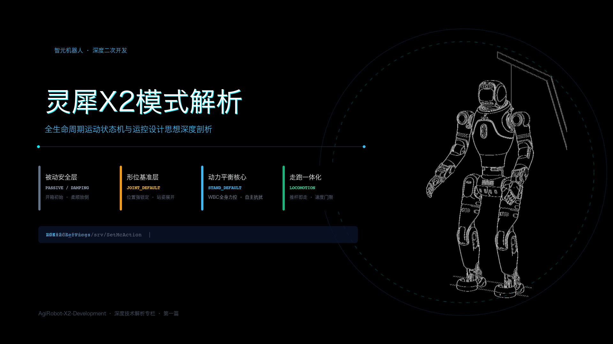
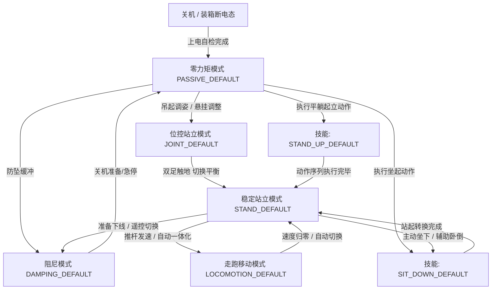

# 灵犀 X2 机器人的模式体系解析



> **官方参考与资源**：
> - 智元 AimDK 官方文档与资源包下载地址：[https://x2-aimdk.agibot.com/zh-cn/latest/index.html](https://x2-aimdk.agibot.com/zh-cn/latest/index.html)
> - 适用 SDK 版本：`v1.0.0`
> - **图片版权与来源声明**：本文涉及的所有机器人物理姿态与操作示意图片，均提取自智元官方 SDK v1.0.0 资源包。

---

## 目录
- [一、 前置技术原理：ROS 2 Service 与灵犀 X2 接口规范](#一-前置技术原理ros-2-service-与灵犀-x2-接口规范)
  - [1.1 为什么是 Service 而不是 Topic？](#11-为什么是-service-而不是-topic)
  - [1.2 灵犀 X2 模式服务定义](#12-灵犀-x2-模式服务定义)
  - [1.3 核心思想：模式切换的最小代码骨架](#13-核心思想模式切换的最小代码骨架)
- [二、 灵犀 X2 模式体系架构与状态机全景](#二-灵犀-x2-模式体系架构与状态机全景)
- [三、 五大核心基准模式图文深度拆解](#三-五大核心基准模式图文深度拆解)
  - [3.1 零力矩模式（PASSIVE_DEFAULT / PD）](#31-零力矩模式passive_default--pd)
  - [3.2 阻尼模式（DAMPING_DEFAULT / DD）](#32-阻尼模式damping_default--dd)
  - [3.3 位控站立模式（JOINT_DEFAULT / JD，站姿预备）](#33-位控站立模式joint_default--jd站姿预备)
  - [3.4 稳定站立模式（STAND_DEFAULT / SD，力控站立）](#34-稳定站立模式stand_default--sd力控站立)
  - [3.5 走跑控制模式（LOCOMOTION_DEFAULT / LD）](#35-走跑控制模式locomotion_default--ld)
  - [3.6 典型预设技能模式：平躺站起与坐下](#36-典型预设技能模式平躺站起与坐下)
- [四、 关键机制点拨：输入源（Input Source）仲裁意识](#四-关键机制点拨输入源input-source仲裁意识)
- [五、 附录：灵犀 X2 全量模式枚举速查表](#五-附录灵犀-x2-全量模式枚举速查表)

---

## 一、 前置技术原理：ROS 2 Service 与灵犀 X2 接口规范

### 1.1 为什么是 Service 而不是 Topic？

在 ROS 2 开发里，很多新手最纠结的就是什么时候用 Topic（话题），什么时候用 Service（服务）。

| 通信机制 | 通信模型 | 数据流向 | 适用场景 |
| :--- | :--- | :--- | :--- |
| **Topic** | 发布-订阅（Publish-Subscribe） | 单向、异步高频连续流 | 传感器数据广播（雷达、IMU、相机）、连续推杆速度指令 |
| **Service** | 请求-响应（Request-Response） | 双向、同步/异步配对事务 | 状态查询、模式切换、硬件复位、离散任务触发 |

灵犀 X2 的机器人模式切换属于典型的**状态跃迁**。

试想一下：你发了一条指令让机器人“切换到力控稳定站立”。如果用单向广播的 Topic，发出去就没了回音，一旦遇到网络丢包或者机器人此时正倒在地上不具备起立条件，你的程序根本不知道底层究竟切没切成功。双足机器人一旦产生状态误判，接下来执行移动算法就很容易摔倒。

因此，灵犀 X2 将所有模式控制严格做成了 Service。发一次请求，底层运控校验后返回成功或失败，客户端确认后再执行下一步：

```
+------------------------+                          +------------------------+
|   二次开发节点 (Client)   |                          |   运控底层服务 (Server)   |
+------------------------+                          +------------------------+
            |                                                   |
            | ----- 1. Request (/aimdk_5Fmsgs/srv/SetMcAction) ->| (校验参数、当前物理约束)
            |                                                   | (执行状态机平滑迁移)
            |<---- 2. Response (status: SUCCESS / FAILED) ------|
            |                                                   |
```

### 1.2 灵犀 X2 模式服务定义

在 AimDK 消息定义中，模式控制只涉及两个核心接口：

1. **设置模式服务**：`/aimdk_5Fmsgs/srv/SetMcAction`
   - **请求体（Request）**：
     - `header`：带时间戳的请求头；
     - `source`：调用者标识（比如自定义的节点名 `"developer_node"`）；
     - `command.action_desc`：目标模式字符串（如 `"STAND_DEFAULT"`）。
   - **响应体（Response）**：
     - `response.status.value`：状态值，返回 `1` 代表执行成功；
     - `response.message`：失败时的错误原因提示。

2. **查询模式服务**：`/aimdk_5Fmsgs/srv/GetMcAction`
   - 响应当前的模式状态（如 `100: 运行中`，`200: 切换中`）以及动作描述。

### 1.3 核心思想：模式切换的最小代码骨架

抛开那些长篇累牍的终端交互代码，模式切换在底层逻辑上非常精炼：**创建 Client $\rightarrow$ 填入目标模式名字 $\rightarrow$ 异步发出去并带 250ms 超时**。

#### C++ 核心调用范式
```cpp
// 1. 构造模式切换请求
auto request = std::make_shared<aimdk_msgs::srv::SetMcAction::Request>();
request->source = "developer_node";           // 标明控制来源
request->command.action_desc = "STAND_DEFAULT"; // 目标模式

// 2. 发送请求（跨板网络通信，带 250ms 超时等待）
request->header.stamp = node->now();
auto future = client->async_send_request(request);
if (rclcpp::spin_until_future_complete(node, future, 250ms) == rclcpp::FutureReturnCode::SUCCESS) {
    if (future.get()->response.status.value == CommonState::SUCCESS) {
        // 机器人成功进入目标模式
    }
}
```

#### Python 并列对照
```python
# 构造请求并下发
req = SetMcAction.Request()
req.source = 'developer_py_node'
req.command.action_desc = 'STAND_DEFAULT'
req.header.stamp = node.get_clock().now().to_msg()

future = client.call_async(req)
rclpy.spin_until_future_complete(node, future, timeout_sec=0.25)
if future.done() and future.result().response.status.value == CommonState.SUCCESS:
    # 切换成功
```

> **控制思想**：  
> 做人形二次开发时，我们不需要直接去算几十个电机的逆动力学。通过 Service，我们其实是在向机器人的运控状态机传递“意图”。运控节点确认当前机体处于合法姿态后，会在底层自动完成轨迹插值与力矩平滑过渡。

---

## 二、 灵犀 X2 模式体系架构与状态机全景

双足机器人没法像轮式底盘那样随时直接行走，它受制于严格的重力与动态平衡规律。灵犀 X2 的运控底层设计了一套状态机，规范了机体从物理躺姿到力控行走的整个流转过程：



这套状态机遵循三个基本物理规律：
1. **被动安全层（零力矩、阻尼）**：电机不进行主动的位置或力闭环，属于失能或阻抗状态；
2. **形位基准层（位控站立）**：作为过渡，先用纯角度刚性把机身拉回标准站立构型；
3. **动力学平衡核心（稳定站立）**：算法真正接管全身重力与地面接触力。只有站稳了，才允许执行走跑和上身大幅度动作。

---

## 三、 五大核心基准模式图文深度拆解

在官方操作手册里，机器人的日常使用其实就两条链路：一条是从开箱平躺到站起来的**启动链路**；另一条是测试完毕从站姿平稳放倒装箱的**下线链路**。

弄懂各模式在这两条链路里的角色，就能彻底理解运控工程师的设计意图。

### 3.1 零力矩模式（PASSIVE_DEFAULT / PD）

- **枚举定义**：`aimdk_msgs::msg::McAction::PASSIVE_DEFAULT = 1`
- **简写代码**：`PD`（Passive Default）

在平躺起立流程中，机器人开机自检结束后的初始待命姿态就是零力矩模式：


#### 机器人物理状态与受力表现
电机处于使能通电状态，但输出力矩为零。各关节完全顺应重力下垂。你用手去搬动机器人的四肢，感觉不到任何主动阻力，各个关节非常轻巧、活动自如。

#### 为什么需要这个模式？
1. **开机初始安全**：开机阶段各个传感器和动力学参数还在校准，不能冒然让电机发力，零力矩是最安全的中立态。
2. **人工摆姿与装箱**：机器人在搬运、装箱折叠或换电池时，需要工程师手动把四肢推进泡沫槽，必须在零力矩下操作。
3. **紧急保护泄力**：遇到突发情况或者触发急停开关时，系统迅速卸掉力矩，防止电机死咬导致减速器齿轮打齿或伤到周围的人。

---

### 3.2 阻尼模式（DAMPING_DEFAULT / DD）

- **枚举定义**：`aimdk_msgs::msg::McAction::DAMPING_DEFAULT = 3`
- **简写代码**：`DD`（Damping Default）

在关机下线链路中，机器人正是通过阻尼模式实现安全平稳的受控放倒：


#### 机器人物理状态与受力表现
电机底层运行纯速度反向阻尼算法。关节静止时不发力；外力拖动它运动越快，关节反向阻力越大。用手搬动关节时，感觉像是在推一根阻尼感很强的液压杆。

#### 为什么需要这个模式？
1. **防止自重坠毁砸坏零件**：双足机器人下线平躺时，如果直接切断力矩（切入零力矩），整机几十公斤的自重会在重力作用下瞬间直挺挺摔在地上，极其容易砸坏昂贵的谐波减速器和传感器。
2. **下线缓冲保护**：官方推荐的标准下线流程如上图 Step 1~3 所示：**位控预备 $\rightarrow$ 人工托扶放倒 $\rightarrow$ 阻尼模式缓冲 $\rightarrow$ 零力矩 $\rightarrow$ 关机**。有了阻尼吸收能量，两个人轻轻托着就能把机器人平稳放平。

---

### 3.3 位控站立模式（JOINT_DEFAULT / JD，站姿预备）

- **枚举定义**：`aimdk_msgs::msg::McAction::JOINT_DEFAULT = 100`
- **简写代码**：`JD`（Joint Default / Position Control Stand）

在移位机吊起开机链路中，从零力矩激活后，首先进入的就是“站姿预备”位控模式（如下方图示中的 Step 4-1 与 Step 4-2）：


#### 机器人物理状态与受力表现
双腿和躯干关节运行高刚度位置闭环 PID 控制。所有关节死死锁固在预先标定的出厂角度上，机体表现得像一副刚性骨架。

#### 为什么需要这个模式？
1. **建立几何基准**：双足机器人由多连杆组成。如果直接在关节七扭八歪的状态下开启全身力控，质心估算和雅可比矩阵会全乱套。位控模式的作用是在力控前先把腿拉直、把骨架形态归正。
2. **吊架调试必备**：配合电动移位机使用时（如上图 Step 4-1/4-2），悬空状态下先切位控站立，把腿展直，然后再往下放吊绳直到双脚掌平整踩地。
3. **重要禁忌**：**绝对不要在位控模式下让机器人自主行走！** 因为位控完全没有地面反作用力柔顺调节，脚掌碰到地面的任何凹凸都会产生巨大的刚性冲击，导致电机过载报警。

---

### 3.4 稳定站立模式（STAND_DEFAULT / SD，力控站立）

- **枚举定义**：`aimdk_msgs::msg::McAction::STAND_DEFAULT = 200`
- **简写代码**：`SD`（Stable Stand / Auto-balance）

当机器人双脚完全平稳踩实地面、吊绳挂钩解开后，切入稳定站立状态，展现出完全自主的动态平衡：


#### 机器人物理状态与受力表现
全身动力学控制器（WBC）全面接管。足底力觉、躯干位姿与 IMU 闭环运转，电机高频输出对冲力矩。此时用手推搡机器人的躯干，能明显感到它会顺势微调卸力并立刻主动弹回中心，重心垂线始终稳稳落在双脚支撑面内。

#### 为什么需要这个模式？
1. **真正的自主抗扰站立**：不再需要任何挂绳或外力扶持，机器人靠自身算法稳定站立。
2. **所有移动与操作的唯一底座**：不管是手臂挥手比心、头部巡视还是下肢走跑，机器人都必须先稳定在 `STAND_DEFAULT` 模式。
3. **操作要点**：切入该模式前，**必须确保双脚掌已经踏平地面**。如果人在半空中悬吊着就切入力控，脚掌测不到地表反作用力，腿部算法可能会产生剧烈误摆。

---

### 3.5 走跑控制模式（LOCOMOTION_DEFAULT / LD）

- **枚举定义**：`aimdk_msgs::msg::McAction::LOCOMOTION_DEFAULT = 300`
- **简写代码**：`LD`（Locomotion Default）

#### 机器人物理状态与受力表现
机器人打破静态平衡，进入周期性迈步循环。单脚支撑与双脚交替摆动快速切换，重心按倒立摆轨迹平稳向前推移。

#### 核心设计机制
1. **“站-走一体化”（v0.8.0+ / v1.0.0 核心演进）**：
   老版本固件需要手动发请求从站立切到行走模式，而现在的 SDK 架构全面升级为一体化设计：只要机器人处于 `STAND_DEFAULT` 稳定站立，你通过话题 `/aima/mc/locomotion/velocity` 推速度，机器人就会顺滑迈步开走；推杆回中、速度归零后，机器人又会自动平稳立定，无需再手动切换模式。
2. **起步死区门限（Threshold）**：
   为防止手柄摇杆漂移或微小噪声引起双腿频繁抽动，运控层设置了初始起步门限：
   - 纵向速度（`forward_velocity`）：必须达到 0.09 m/s 以上；
   - 横移速度（`lateral_velocity`）：绝对值必须达到 0.60 m/s 以上；
   - 偏航转向速度（`angular_velocity`）：绝对值必须达到 0.03 rad/s 以上。
   只有越过这个死区门限，机器人底盘才会跨出第一步；一旦步态跑顺了，后续保持阶段就可以降到更低的速度巡航。

---

### 3.6 典型预设技能模式：平躺站起与坐下

如果现场没有移位机吊架，灵犀 X2 还自带了经过严密离线轨迹规划的预设动作链：

#### 1. 平躺站起（STAND_UP_DEFAULT = 2005）
把机器人仰面平躺放在平整地面上（零力矩态），下发 `STAND_UP_DEFAULT` 指令后，机器人会依次蜷腿收腹、腰部发力、双臂协同撑地推起躯干，动作做完后自动无缝切入 `STAND_DEFAULT` 稳定站立（如下图 Step 5 序列所示）：


#### 2. 坐下模式（SIT_DOWN_DEFAULT = 2000）
把机器人引到高度约 35~40cm 的稳固矮凳或台阶前，触发坐下指令，机器人会自动屈膝、后坐重心、平稳坐在凳面上，随后释放双腿负荷，非常方便桌面端调试与静态语音交互：


---

## 四、 关键机制点拨：输入源（Input Source）仲裁意识

在后续编写走跑和位移代码时，大家很快就会在消息结构里遇到一个名为 `source` 的字符串字段。在这里提前建立正确的系统直觉：

> **核心原则：灵犀 X2 运控底层只执行“当前最高优先级且处于活跃心跳”的那个控制端。**

1. **为什么给移动话题发了速度，机器人却纹丝不动？**
   很多新手把代码写好往 `/aima/mc/locomotion/velocity` 发速度，机器人毫无反应。原因就是你的 `source` 没有事先在系统里注册过，底层运控把它当成了“未知来源数据包”，直接静默丢弃了。
2. **系统内置的优先级阶梯**：
   - 遥控手柄（`rc`）：优先级 **80**，超时 1000ms（最高仲裁权，保证安全人员能随时人工抢回控制权防摔）；
   - 手机 APP（`app_proxy`）：优先级 **60**；
   - 灵犀交互（`interaction`）：优先级 **50**；
   - 自主规划（`pnc`）：优先级 **40**；
   - **二次开发代码**：建议注册在 **20 ~ 40** 之间。
3. **二开安全防摔闭环**：
   因为遥控手柄（80）天然压制二开代码（40），你在实验室测试自主行走算法时，安全员手里拿着手柄推一下杆，就能瞬间夺回控制权纠偏；松开手柄超 1000ms 后，控制权又平稳回到二开程序手中。

*(关于输入源 `SetMcInputSource` 的完整注册、注销与动态争抢实操，我们会在第四篇专栏里彻底讲透。)*

---

## 五、 附录：灵犀 X2 全量模式枚举速查表

在编写业务逻辑判断返回值时，可直接查阅下表：

| 模式宏定义常量 | 枚举值 (int32) | 中文名称 | 控制属性 | 典型用途 |
| :--- | :--- | :--- | :--- | :--- |
| `PASSIVE_DEFAULT` | 1 | 零力矩模式 | 被动安全 | 开机初始、折叠装箱、软急停、搬运 |
| `SOFT_EMERGENCY_STOP` | 2 | 软急停模式 | 安全保护 | 触发安全告警时受控泄力停止 |
| `DAMPING_DEFAULT` | 3 | 阻尼模式 | 被动安全 | 人工辅助放倒、下线缓冲防摔 |
| `ZERO_TORQUE_DEFAULT`| 4 | 零力矩默认模式 | 被动安全 | 关节标定、维护状态 |
| `JOINT_DEFAULT` | 100 | 位控站立模式 | 刚性位置闭环 | 吊起展开、标定几何零位基准 |
| `JOINT_FREEZE` | 101 | 关节锁定模式 | 刚性位置闭环 | 紧急制动下保持当前角度刚性锁定 |
| `STAND_DEFAULT` | 200 | 稳定站立模式 | 全身动力学力控 | 自主平衡站立、上肢操作就绪、走跑起点 |
| `STAND_BODY_CONTROL` | 201 | 站立+身体运动 | 全身动力学力控 | 站立状态下调整质心高度、倾角与姿态 |
| `LOCOMOTION_DEFAULT` | 300 | 走跑移动模式 | 动态步态规划 | 全向走跑位移（推杆即走，与 SD 一体化） |
| `RUN_DEFAULT` | 301 | 跑步模式 | 高动态步态 | 高速跑步位移（需场地条件满足） |
| `LOCOMOTION_STEP` | 302 | 越野踏步模式 | 适应性步态 | 碎石路面、低矮障碍越野跨越 |
| `VR_REMOTE_CONTROLLER`| 400 | VR 遥控模式 | 遥操控制 | VR 头显与手柄实时全身映射（预留） |
| `SIT_DOWN_DEFAULT` | 2000 | 坐下模式 | 预设技能动作 | 35~40cm 台阶自主坐下 |
| `CROUCH_DOWN_DEFAULT`| 2002 | 蹲下模式 | 预设技能动作 | 原地下蹲降低机身重心 |
| `LIE_DOWN_DEFAULT` | 2004 | 躺倒模式 | 预设技能动作 | 受控平稳仰卧躺倒 |
| `STAND_UP_DEFAULT` | 2005 | 平躺站起模式 | 预设技能动作 | 从仰身平躺状态自主撑起站立 |
| `ASCEND_STAIRS` | 2006 | 上楼梯模式 | 预设技能动作 | 规则台阶自主攀爬跨越 |
| `DESCEND_STAIRS` | 2008 | 下楼梯模式 | 预设技能动作 | 规则台阶自主下行 |

---
*本文档为灵犀 X2 机器人二次开发系列专栏第一篇。下一篇我们将探讨：《灵犀 X2 的表情控制：从交互服务到屏幕渲染》。*
