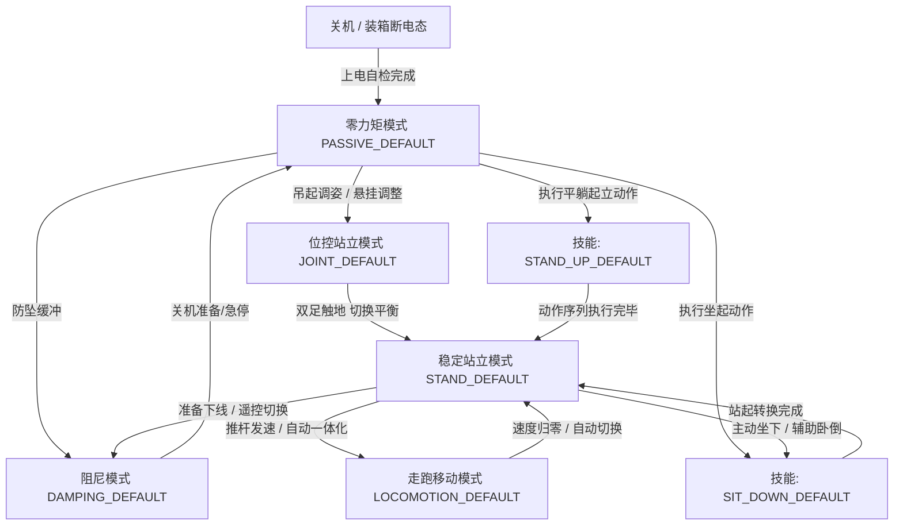
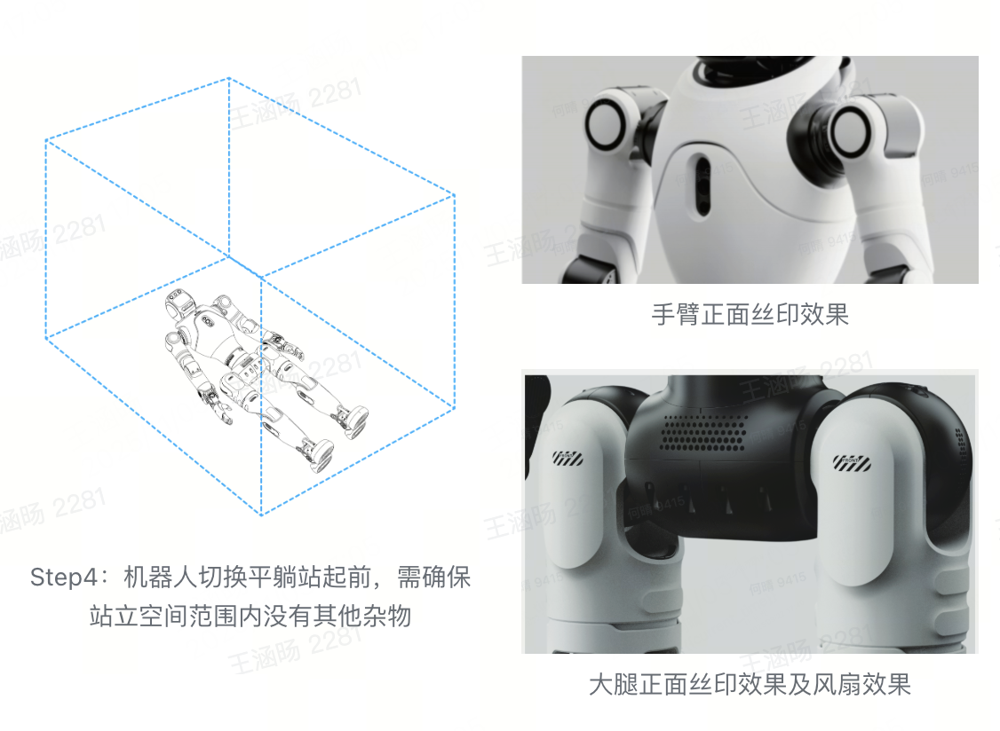
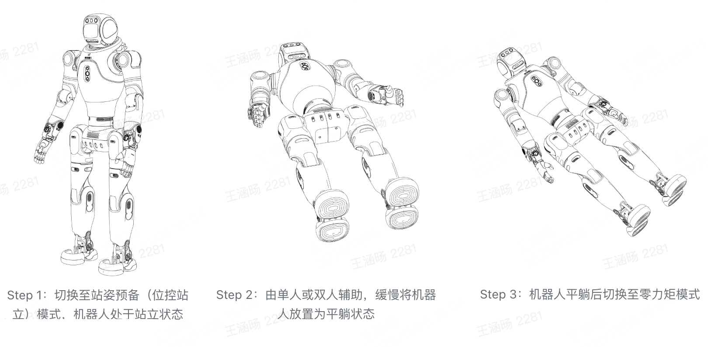
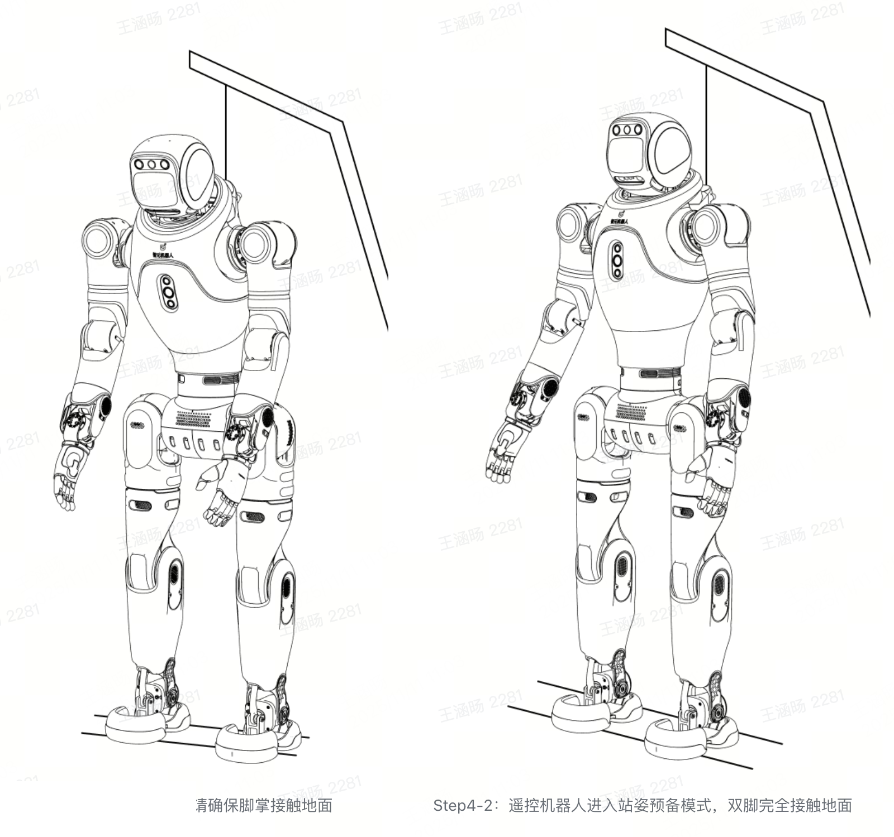
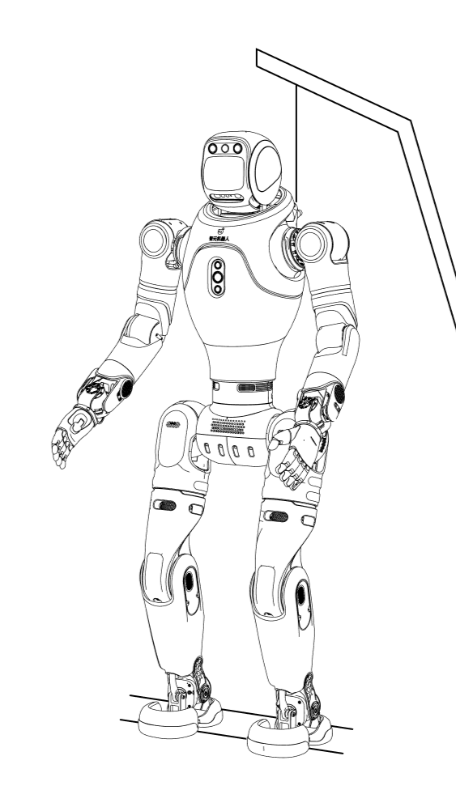
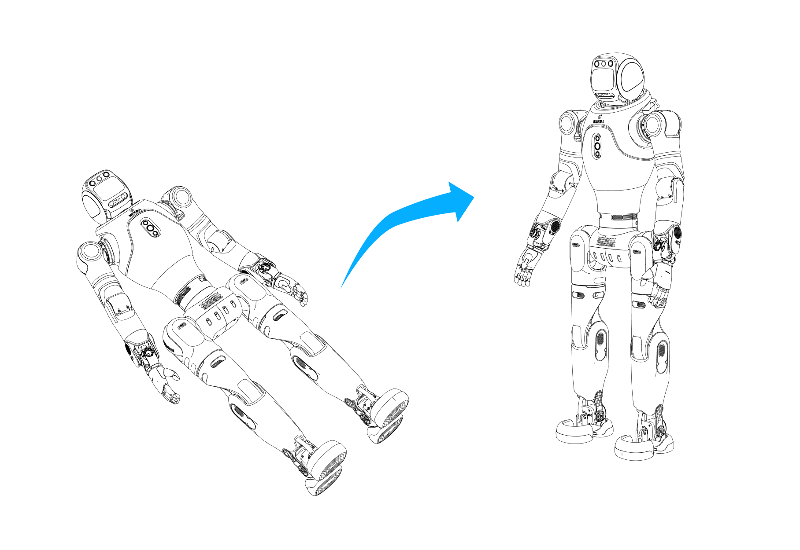

# 灵犀 X2 机器人的模式体系解析

> **官方参考与资源**：
> - 智元 AimDK 官方文档与资源包下载地址：[https://x2-aimdk.agibot.com/zh-cn/latest/index.html](https://x2-aimdk.agibot.com/zh-cn/latest/index.html)
> - 适用 SDK 版本：`v1.0.0`
> - **图片版权与来源声明**：本文涉及的所有机器人物理姿态与操作示意图片，均提取自智元官方 SDK v1.0.0 资源包。

---

## 目录
- [一、 前置技术原理：ROS 2 Service 与灵犀 X2 接口规范](#一-前置技术原理ros-2-service-与灵犀-x2-接口规范)
  - [1.1 为什么是 Service 而不是 Topic？](#11-为什么是-service-而不是-topic)
  - [1.2 灵犀 X2 模式服务定义](#12-灵犀-x2-模式服务定义)
  - [1.3 核心思想：模式切换的最小代码骨架](#13-核心思想模式切换的最小代码骨架)
- [二、 灵犀 X2 模式体系架构与状态机全景](#二-灵犀-x2-模式体系架构与状态机全景)
- [三、 五大核心基准模式图文深度拆解](#三-五大核心基准模式图文深度拆解)
  - [3.1 零力矩模式（PASSIVE_DEFAULT / PD）](#31-零力矩模式passive_default--pd)
  - [3.2 阻尼模式（DAMPING_DEFAULT / DD）](#32-阻尼模式damping_default--dd)
  - [3.3 位控站立模式（JOINT_DEFAULT / JD，站姿预备）](#33-位控站立模式joint_default--jd站姿预备)
  - [3.4 稳定站立模式（STAND_DEFAULT / SD，力控站立）](#34-稳定站立模式stand_default--sd力控站立)
  - [3.5 走跑控制模式（LOCOMOTION_DEFAULT / LD）](#35-走跑控制模式locomotion_default--ld)
  - [3.6 典型预设技能模式：平躺站起与坐下](#36-典型预设技能模式平躺站起与坐下)
- [四、 关键机制点拨：输入源（Input Source）仲裁意识](#四-关键机制点拨输入源input-source仲裁意识)
- [五、 附录：灵犀 X2 全量模式枚举速查表](#五-附录灵犀-x2-全量模式枚举速查表)

---

## 一、 前置技术原理：ROS 2 Service 与灵犀 X2 接口规范

### 1.1 为什么是 Service 而不是 Topic？

在 ROS 2 机器人通信中，最常见的两种机制是 **Topic（话题）** 与 **Service（服务）**：

| 通信机制 | 通信模型 | 数据流向 | 适用场景 |
| :--- | :--- | :--- | :--- |
| **Topic** | 发布-订阅（Publish-Subscribe） | 单向、异步高频连续流 | 传感器数据广播（激光雷达、IMU、摄像头画面）、高频速度推杆指令 |
| **Service** | 请求-响应（Request-Response） | 双向、同步/异步配对事务 | 状态查询、模式切换、硬件复位、离散任务触发 |

灵犀 X2 的机器人模式切换属于典型的**强状态突变操作**。调用者下发“切换到力控站立”的指令后，必须明确知晓运控底层是否接受、状态转移是否成功。若采用无反馈的单向 Topic，一旦发生通信丢包，调用方将无法获知机器人的真实物理状态，极易造成误判。因此，灵犀 X2 将模式控制全部设计为 ROS 2 Service。

```
+------------------------+                          +------------------------+
|   二次开发节点 (Client)   |                          |   运控底层服务 (Server)   |
+------------------------+                          +------------------------+
            |                                                   |
            | ----- 1. Request (/aimdk_5Fmsgs/srv/SetMcAction) ->| (校验参数、当前状态约束)
            |                                                   | (执行状态机迁移)
            |<---- 2. Response (status: SUCCESS / FAILED) ------|
            |                                                   |
```

### 1.2 灵犀 X2 模式服务定义

在 AimDK 消息包中，模式的查询与设置依赖两个标准 Service：

1. **设置模式服务**：`/aimdk_5Fmsgs/srv/SetMcAction`
   - **请求数据类型**：`aimdk_msgs::srv::SetMcAction::Request`
     - `header`：包含时间戳的标准请求头。
     - `source`：指令来源标识字符串（例如 `"node"` 或自定义名称）。
     - `command.action_desc`：目标模式字符串描述（如 `"STAND_DEFAULT"`）。
   - **响应数据类型**：`aimdk_msgs::srv::SetMcAction::Response`
     - `response.status.value`：状态码，`1` 表示成功（对应 `CommonState::SUCCESS`）。
     - `response.message`：文本详情或错误原因。

2. **查询模式服务**：`/aimdk_5Fmsgs/srv/GetMcAction`
   - 返回当前的 `McActionStatus`（如 `100: 运行中`，`200: 切换中`）及当前动作描述。

### 1.3 核心思想：模式切换的最小代码骨架

抛开外围的参数解析与终端交互，模式切换在底层逻辑上极为精炼：**创建 Client $\rightarrow$ 填充目标模式字符串 $\rightarrow$ 异步发送并处理跨板超时**。

#### C++ 核心调用范式
```cpp
// 1. 构造模式切换请求
auto request = std::make_shared<aimdk_msgs::srv::SetMcAction::Request>();
request->source = "developer_node";           // 标明控制来源
request->command.action_desc = "STAND_DEFAULT"; // 目标模式

// 2. 发送请求（跨板通信建议带 250ms 超时与重试机制）
request->header.stamp = node->now();
auto future = client->async_send_request(request);
if (rclcpp::spin_until_future_complete(node, future, 250ms) == rclcpp::FutureReturnCode::SUCCESS) {
    if (future.get()->response.status.value == CommonState::SUCCESS) {
        // 机器人成功进入目标模式
    }
}
```

#### Python 并列对照
```python
# 构造请求并下发
req = SetMcAction.Request()
req.source = 'developer_py_node'
req.command.action_desc = 'STAND_DEFAULT'
req.header.stamp = node.get_clock().now().to_msg()

future = client.call_async(req)
rclpy.spin_until_future_complete(node, future, timeout_sec=0.25)
if future.done() and future.result().response.status.value == CommonState.SUCCESS:
    # 切换成功
```

> **设计思想提炼**：  
> 开发者无需直接面对底层电机的逆动力学解算，只需通过 Service 向运控状态机下发合法的“意图（Intention）”。运控节点完成安全性前置校验后，自动在底层规划插值与力矩平滑过渡。

---

## 二、 灵犀 X2 模式体系架构与状态机全景

灵犀 X2 机器人具备高度非线性的双足双臂机体结构。运控底层设计了一套严格的状态机（Finite State Machine, FSM），规范了机器人从断电物理姿态到动态力控行走的生命周期：



状态转移遵循严格的**物理边界约束**：
1. **零力矩**与**阻尼**属于被动安全层，电机不进行外环位置或力闭环调节；
2. **位控站立**作为过渡阶段，建立初始的关节几何基准；
3. **稳定站立**是整机进入动力学平衡的核心分水岭，只有进入该模式后，机器人才具备抗扰动能力，并允许走跑与上肢操作。

---

## 三、 五大核心基准模式图文深度拆解

在官方使用指南中，机器人的操作流程包含两条典型链路：一条是从开箱平躺到自主起立的**启动链路**；另一条是从站姿平稳放倒入库的**下线链路**。下面我们结合两条链路的实物操作步骤，深度剖析各模式背后的物理状态与控制思想。

### 3.1 零力矩模式（PASSIVE_DEFAULT / PD）

- **枚举定义**：`aimdk_msgs::msg::McAction::PASSIVE_DEFAULT = 1`
- **简写代码**：`PD`（Passive Default）

在平躺起立流程中，开机自检完成后的初始待命状态即为零力矩模式（如下方图示中的平躺姿态规范）：



#### 机器人物理状态与受力表现
电机驱动器处于使能状态但输出力矩为零（$\tau = 0$）。各关节失去主动抵抗外力的能力，在自重作用下会顺应重力下垂。用手推动机器人的四肢时，感觉轻盈无阻力，如同完全松弛的活动关节。

#### 核心设计思想与使用场景
1. **物理安全初始态**：开机自检完成后的初始待命状态。
2. **免工具收纳与装箱**：机器人在装箱、搬运、拆装电池时，需要人工手动将其四肢折叠至包装槽中，此时必须处于零力矩模式。
3. **硬保护泄力**：在遭遇突发故障或按下紧急停止时，系统迅速切入零力矩，防止电机因硬性堵转而烧毁减速器或伤及人员。

---

### 3.2 阻尼模式（DAMPING_DEFAULT / DD）

- **枚举定义**：`aimdk_msgs::msg::McAction::DAMPING_DEFAULT = 3`
- **简写代码**：`DD`（Damping Default）

在关机下线链路中，机器人正是通过阻尼模式实现安全平稳的受控放倒（如下方图示中的 Step 1~3 关机流转）：



#### 机器人物理状态与受力表现
电机底层运行纯速度反向阻尼控制算法（$\tau = -B \cdot \dot{q}$）。当关节静止时，电机不产生主动驱动力矩；当外力强行拖动关节运动时，关节会输出与角速度方向相反的粘滞阻抗。手动扳动关节时，感觉如同在推动高粘度液压杆。

#### 核心设计思想与使用场景
1. **防止自重坠毁砸伤**：双足机器人下线平躺时，若直接从站姿切断力矩（切入零力矩），整机将由于重力瞬间直挺挺砸向地面，损坏精密减速器与机载传感器。
2. **柔顺下线缓冲**：在关机指南中，官方强烈推荐的流程如上图 Step 1~3 所示：**位控预备 $\rightarrow$ 人工托扶放倒 $\rightarrow$ 阻尼模式缓冲 $\rightarrow$ 零力矩 $\rightarrow$ 关机**。阻尼吸收了重力势能，使操作人员只需极小力量即可平稳托住机器人后背放倒。

---

### 3.3 位控站立模式（JOINT_DEFAULT / JD，站姿预备）

- **枚举定义**：`aimdk_msgs::msg::McAction::JOINT_DEFAULT = 100`
- **简写代码**：`JD`（Joint Default / Position Control Stand）

在移位机吊起开机链路中，机器人从零力矩激活后，首先进入的就是“站姿预备”位控模式（如下方图示中的 Step 4-1 与 Step 4-2）：



#### 机器人物理状态与受力表现
双腿和各关节开启高刚度位置闭环 PID 控制。所有关节死死锁固在预先标定的“站姿几何角度”，机器人整体呈现刚性骨架特征。

#### 核心设计思想与使用场景
1. **建立几何形位基准**：双足机器人由多个高阶非线性连杆组成。若直接在非标定姿态下开启全身力控，质心估算与雅可比矩阵将失真。位控模式的作用是在力控前建立标准的双腿几何拓扑。
2. **吊起与悬挂调试**：配合移位机吊具使用（如上图 Step 4-1/4-2 所示）。在悬空状态下，将机器人切换为位控站姿，随后降下吊绳，使双脚掌平整接触地面。
3. **重要限制**：**位控站立模式绝不能用于地面自主行走！** 因其缺乏地面接触力柔顺调节，足底与地面的轻微刚性冲击便可能引发剧烈震颤甚至关节电机过载报警。

---

### 3.4 稳定站立模式（STAND_DEFAULT / SD，力控站立）

- **枚举定义**：`aimdk_msgs::msg::McAction::STAND_DEFAULT = 200`
- **简写代码**：`SD`（Stable Stand / Auto-balance）

当机器人双足平稳触地、完全脱离吊绳挂钩后，切入稳定站立状态，展现出完全自主的动态平衡姿态：



#### 机器人物理状态与受力表现
机器人的全身动力学控制器（Whole-Body Controller, WBC）全面介入。足底、躯干传感器与 IMU 构成闭环，电机主动输出高频调整力矩。此时用手推搡机器人的躯干，能明显感受到机器人顺应外力轻微微调并迅速主动回弹，始终保持重心垂线投影在双足支撑多边形内部。

#### 核心设计思想与使用场景
1. **真·自主动态平衡**：机器人不再依赖任何外部挂绳或外力支撑，实现完全自主平衡站立。
2. **所有运动任务的唯一锚点**：无论是后续执行走跑、头部转动、双臂比心、挥手还是搬运物体，机器人底盘都必须首先稳定在 `STAND_DEFAULT` 模式。
3. **注意项**：切换进入该模式前，**必须确保双足已完全平稳着地**。如果在悬空状态下直接切入力控站立，足底因探测不到反作用力会导致腿部剧烈摆动误动作。

---

### 3.5 走跑控制模式（LOCOMOTION_DEFAULT / LD）

- **枚举定义**：`aimdk_msgs::msg::McAction::LOCOMOTION_DEFAULT = 300`
- **简写代码**：`LD`（Locomotion Default）

#### 机器人物理状态与受力表现
机器人打破静态平衡，进入动态行走或跑步步态循环。单腿支撑期与双腿交替摆动期快速轮换，质心按倒立摆轨迹平滑移动。

#### 核心设计思想与使用场景
1. **“站-走一体化”设计（v0.8.0+ / v1.0.0 核心演进）**：
   在早期的开发固件中，开发者需要显式调用模式切换进入走跑模式；而在当前 SDK 架构下，**稳定站立与走跑模式采用一体化设计**。机器人只要处于 `STAND_DEFAULT` 状态，一旦接收到速度控制话题 `/aima/mc/locomotion/velocity` 的有效推杆速度，运控底层会自动无缝切入步态；一旦速度归零或超时，底层自动平稳回退至稳定站立。
2. **起步门限（Deadzone Threshold）机制**：
   双足行走启动需要克服静态摩擦与机身惯性。为防止手柄遥控器微小抖动或浮点噪点引起电机无意义的抽动，灵犀 X2 设定了**初始迈步门限**：
   - 纵向速度（`forward_velocity`）：必须 $\ge 0.09\text{ m/s}$；
   - 横移速度（`lateral_velocity`）：绝对值必须 $\ge 0.60\text{ m/s}$；
   - 偏航角速度（`angular_velocity`）：绝对值必须 $\ge 0.03\text{ rad/s}$。
   只有当目标速度超越门限时，步态发生器才会迈出第一步；一旦运动建立，维持阶段方可平滑降低至更低速度。

---

### 3.6 典型预设技能模式：平躺站起与坐下

除 5 大基础物理模式外，灵犀 X2 还预装了多阶非线性轨迹规划器，用于实现无吊机自主开机与状态恢复：

#### 1. 平躺站起（STAND_UP_DEFAULT = 2005）
无需吊架。将机器人仰身平躺放于平整地面（处于零力矩态），触发 `STAND_UP_DEFAULT` 指令后，机器人会依次经历蜷腿、腰部发力、双臂协同撑地、推举躯干等阶段，最终自动过渡并锁定在 `STAND_DEFAULT` 稳定站立状态（如下图 Step 5 序列所示）：



#### 2. 坐下模式（SIT_DOWN_DEFAULT = 2000）
将机器人放置在高度约为 35~40cm 的稳固台阶或测试凳前方，触发坐下指令，机器人会自动屈膝、后移重心、平稳坐在凳面上，随后释放下肢承载，便于桌面调试或坐姿交互（如下图所示）：


---

## 四、 关键机制点拨：输入源（Input Source）仲裁意识

在后续编写走跑与位移控制代码时，开发者必然会接触到消息结构中的 `source` 字段。这里先建立核心认知：

> **核心原则：灵犀 X2 运控底层只执行“当前最高优先级且处于活跃心跳”的控制源。**

1. **为什么移动代码发了指令机器人却不动？**
   若你的二开代码直接向 `/aima/mc/locomotion/velocity` 发送速度指令，但该 `source` 从未向系统注册过，运控底层会**无提示直接丢弃（drop）**该数据包。
2. **内置优先级阶梯（硬性规范）**：
   - 遥控手柄（`rc`）：优先级 **80**，超时 1000ms（最高仲裁权，保证安全接管防摔）；
   - 手机 APP（`app_proxy`）：优先级 **60**；
   - 灵犀交互（`interaction`）：优先级 **50**；
   - 灵犀路径规划（`pnc`）：优先级 **40**；
   - **二次开发自定义源**：建议注册优先级为 **20 ~ 40**。
3. **二开安全防摔闭环**：
   由于手柄优先级（80）天然高于二开节点（40），在实际测试二开自动算法时，安全员手持手柄只要推杆，就能立刻抢夺控制权接管机身；松开手柄超 1000ms 后，控制权又自动交还给二开程序。

*(关于输入源 `SetMcInputSource` 的完整注册、注销与动态抢夺实战，将在第四篇专栏中深入剖析。)*

---

## 五、 附录：灵犀 X2 全量模式枚举速查表

在二次开发编写状态判断或消息解析时，可对照下表查阅底层 ID 与常量定义：

| 模式宏定义常量 | 枚举值 (int32) | 中文名称 | 控制属性 | 典型用途 |
| :--- | :--- | :--- | :--- | :--- |
| `PASSIVE_DEFAULT` | 1 | 零力矩模式 | 被动安全 | 开机初始、折叠装箱、软急停、搬运 |
| `SOFT_EMERGENCY_STOP` | 2 | 软急停模式 | 安全保护 | 触发安全告警时受控泄力停止 |
| `DAMPING_DEFAULT` | 3 | 阻尼模式 | 被动安全 | 人工辅助放倒、下线缓冲防摔 |
| `ZERO_TORQUE_DEFAULT`| 4 | 零力矩默认模式 | 被动安全 | 关节标定、维护状态 |
| `JOINT_DEFAULT` | 100 | 位控站立模式 | 刚性位置闭环 | 吊起展开、标定几何零位基准 |
| `JOINT_FREEZE` | 101 | 关节锁定模式 | 刚性位置闭环 | 紧急制动下保持当前角度刚性锁定 |
| `STAND_DEFAULT` | 200 | 稳定站立模式 | 全身动力学力控 | 自主平衡站立、上肢操作就绪、走跑起点 |
| `STAND_BODY_CONTROL` | 201 | 站立+身体运动 | 全身动力学力控 | 站立状态下调整质心高度、倾角与姿态 |
| `LOCOMOTION_DEFAULT` | 300 | 走跑移动模式 | 动态步态规划 | 全向走跑位移（推杆即走，与 SD 一体化） |
| `RUN_DEFAULT` | 301 | 跑步模式 | 高动态步态 | 高速跑步位移（需场地条件满足） |
| `LOCOMOTION_STEP` | 302 | 越野踏步模式 | 适应性步态 | 碎石路面、低矮障碍越野跨越 |
| `VR_REMOTE_CONTROLLER`| 400 | VR 遥控模式 | 遥操控制 | VR 头显与手柄实时全身映射（预留） |
| `SIT_DOWN_DEFAULT` | 2000 | 坐下模式 | 预设技能动作 | 35~40cm 台阶自主坐下 |
| `CROUCH_DOWN_DEFAULT`| 2002 | 蹲下模式 | 预设技能动作 | 原地下蹲降低机身重心 |
| `LIE_DOWN_DEFAULT` | 2004 | 躺倒模式 | 预设技能动作 | 受控平稳仰卧躺倒 |
| `STAND_UP_DEFAULT` | 2005 | 平躺站起模式 | 预设技能动作 | 从仰身平躺状态自主受力撑起站立 |
| `ASCEND_STAIRS` | 2006 | 上楼梯模式 | 预设技能动作 | 规则台阶自主攀爬跨越 |
| `DESCEND_STAIRS` | 2008 | 下楼梯模式 | 预设技能动作 | 规则台阶自主下行 |

---
