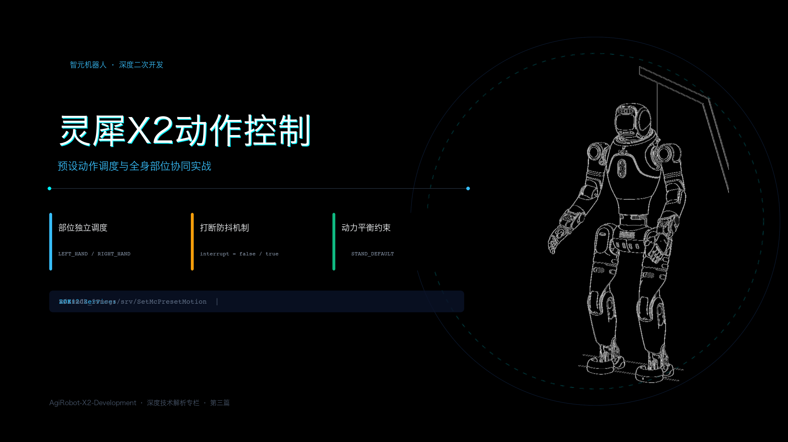
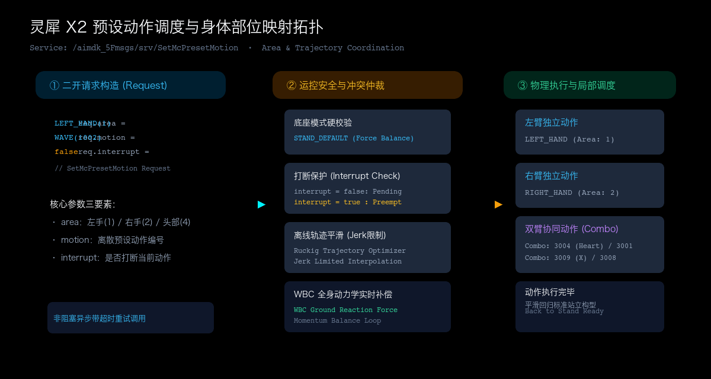

# 灵犀 X2 的动作控制：预设动作与全身部位调度



> **官方参考与资源**：
> - 智元 AimDK 官方文档与资源包下载地址：[https://x2-aimdk.agibot.com/zh-cn/latest/index.html](https://x2-aimdk.agibot.com/zh-cn/latest/index.html)
> - 适用 SDK 版本：`v1.0.0`
> - **图片版权与来源声明**：封面机体形象来源于官方 SDK 资源；动作调度拓扑架构图为本文结合系统机制原创绘制。

---

## 目录
- [一、 为什么人形机器人需要“预设动作库”？](#一-为什么人形机器人需要预设动作库)
- [二、 动作是怎样被调度的？（部位与动作映射模型）](#二-动作是怎样被调度的部位与动作映射模型)
- [三、 关键代码：触发动作的最小代码骨架](#三-关键代码触发动作的最小代码骨架)
  - [3.1 C++ 极简调用范式](#31-c-极简调用范式)
  - [3.2 Python 极简调用范式](#32-python-极简调用范式)
- [四、 必看的工程调用提示与避坑清单](#四-必看的工程调用提示与避坑清单)
  - [4.1 避坑第一条：底座红线——必须处于 STAND_DEFAULT](#41-避坑第一条底座红线必须处于-stand_default)
  - [4.2 避坑第二条：理解 interrupt 的急切与排队逻辑](#42-避坑第二条理解-interrupt-的急切与排队逻辑)
  - [4.3 避坑第三条：选装灵巧手（OmniHand）时的限位保护](#43-避坑第三条选装灵巧手omnihand时的限位保护)
- [五、 附录：灵犀 X2 预设动作编码（McPresetMotion）速查表](#五-附录灵犀-x2-预设动作编码mcpresetmotion速查表)

---

## 一、 为什么人形机器人需要“预设动作库”？

刚开始做双足机器人二次开发时，很多人第一反应就是直接去算机械臂的逆运动学（IK），或者直接给每个关节下发目标角度。

但在双足机器人上，这很容易出问题。

双臂各有 7 个自由度，快速抬起一只手臂时，机械臂本身的质量和惯性会立刻破坏机身的质心平衡。如果底层算法没有配合补偿，机器人很可能当场后仰或侧倾。此外，多关节如果在加速阶段产生过冲，高减速比的精密关节就可能发生剧烈抖动。

智元官方提供的 **预设动作系统（Preset Motion）** 正是解决这个问题的标准答案。

这些内置动作（如招手、握手、头顶比心、点赞）在出厂前就已经通过 Ruckig 等高级轨迹规划算法完成了平滑插值，关节的加加速度（Jerk）被严格限制在安全范围内。在调用这些动作时，底层的全身动力学控制器（WBC）会自动分配双腿的反作用力矩来抵消双臂挥动带来的扰动。

因此，在自己手写复杂的轨迹规划算法之前，用好官方预设动作库是实现人机交互最稳妥、最安全的捷径。

---

## 二、 动作是怎样被调度的？（部位与动作映射模型）

灵犀 X2 的预设动作调度包含一个清晰的三段式链路：**请求构造 $\rightarrow$ 运控仲裁 $\rightarrow$ 物理部位映射**。



### 1. 身体部位解耦（McControlArea）
官方通过一个专门的部位枚举消息 `McControlArea`，把身体执行器分成了独立的控制区：
- `LEFT_HAND = 1`：左臂/左手区域
- `RIGHT_HAND = 2`：右臂/右手区域
- `HEAD = 4`：头部转动区域
- `WAIST = 8`：腰部区域

这种解耦设计的精妙之处在于：**同一个动作 ID，可以通过指定不同的部位，分别在不同的肢体上独立呈现**。
比如同样的“挥手（WAVE_HAND = 1002）”：
- 传入 `area = LEFT_HAND`，机器人会优雅地抬起左臂向侧面挥动；
- 传入 `area = RIGHT_HAND`，机器人则会调度右侧机械臂执行镜像的挥手轨迹。

### 2. 双臂协同动作（Combo）
除了单臂动作，动作库里还包含了大量需要双臂甚至腰部参与的高级交互动作（例如头顶比心 `3004`、鞠躬 `3001`、胸前打叉 `3009`、拥抱 `3008` 等）。下发这类动作时，底层会自动接管双臂并协同规划左右手的相对距离，防止两只手臂在胸前发生机械自碰撞。

---

## 三、 关键代码：触发动作的最小代码骨架

灵犀 X2 控制预设动作的 ROS 2 服务接口是：
- 服务路径：`/aimdk_5Fmsgs/srv/SetMcPresetMotion`
- 数据类型：`aimdk_msgs/srv/SetMcPresetMotion`

核心调用只需要三步：选定目标部位、指定动作编号、决定是否打断当前动作。

### 3.1 C++ 极简调用范式

```cpp
#include "aimdk_msgs/srv/set_mc_preset_motion.hpp"
#include "rclcpp/rclcpp.hpp"

// 1. 构造动作请求
auto request = std::make_shared<aimdk_msgs::srv::SetMcPresetMotion::Request>();
request->area.value = 1;        // 部位：1 为左手 (LEFT_HAND)，2 为右手 (RIGHT_HAND)
request->motion.value = 1002;   // 动作：1002 为挥手 (WAVE_HAND)
request->interrupt = false;     // 打断策略：false 表示等前一个动作播完再排队，不强切

// 2. 异步发送并带 250ms 超时判定
request->header.stamp = node->now();
auto future = client->async_send_request(request);

if (rclcpp::spin_until_future_complete(node, future, std::chrono::milliseconds(250)) == 
    rclcpp::FutureReturnCode::SUCCESS) {
    auto res = future.get();
    if (res->response.header.code == 0) {
        RCLCPP_INFO(node->get_logger(), "动作指令已接收，任务ID: %lu", res->response.task_id);
    } else {
        RCLCPP_WARN(node->get_logger(), "动作执行拒绝（可能上一动作尚未结束）");
    }
}
```

### 3.2 Python 极简调用范式

```python
from aimdk_msgs.srv import SetMcPresetMotion
from aimdk_msgs.msg import McControlArea, McPresetMotion
import rclpy

# 构造请求对象
req = SetMcPresetMotion.Request()
req.area.value = McControlArea.RIGHT_HAND   # 部位：右手
req.motion.value = McPresetMotion.WAVE_HAND # 动作：挥手
req.interrupt = False                       # 保护当前动作不被打断
req.header.stamp = node.get_clock().now().to_msg()

# 异步调用
future = client.call_async(req)
rclpy.spin_until_future_complete(node, future, timeout_sec=0.25)

if future.done() and future.result().response.header.code == 0:
    node.get_logger().info(f"右手挥手开始执行，Task ID: {future.result().response.task_id}")
```

---

## 四、 必看的工程调用提示与避坑清单

在真机上调试动作时，有三条至关重要的物理规律和工程经验需要牢记：

### 4.1 避坑第一条：底座红线——必须处于 STAND_DEFAULT
这是调试机械臂动作时**最严重、也最容易忽视的物理红线**。

在第一篇模式解析中我们讲过，灵犀 X2 只有进入 `STAND_DEFAULT`（稳定站立）模式时，底盘的双腿才开启了 WBC 全身动力学力控。

如果机体当前处于吊起悬空状态、位控预备（`JOINT_DEFAULT`）或者零力矩状态，此时向运控发送大幅度的上肢动作：
- 底层通常会直接校验失败并拒绝下发；
- 哪怕指令侥幸穿透，因为双腿没有开启对地反作用力主动调整，手臂抬起的冲击力会直接打破身体平衡，导致机器人机体剧烈震颤甚至摔倒。

> **调用准则**：触发上肢预设动作之前，务必确保机器人已经完全自主稳定站立在地表。

### 4.2 避坑第二条：理解 interrupt 的急切与排队逻辑
请求体中的 `interrupt` 布尔值决定了动作的抢占策略：
- **`interrupt = false`（温和安全策略，推荐日常使用）**：  
  如果机器人此时正在做握手动作，你紧接着发了一条挥手指令，运控系统会认为上一个动作尚未闭环，返回拒绝码，保证动作做完整，避免连续下发造成电机急停急转。
- **`interrupt = true`（抢占插队策略）**：  
  底层会强制中止当前执行中的动作轨迹，并通过 Ruckig 算法从当前瞬时关节速度平滑插值过渡到新动作。适用于收到高优先级语音指令后需要立即切换反应的场景。

### 4.3 避坑第三条：选装灵巧手（OmniHand）时的限位保护
灵犀 X2 标配机械臂末端可以选装两指夹爪（OmniPicker）或五指仿生灵巧手（OmniHand）。

对于五指灵巧手而言，部分预设动作（例如带有地面接触属性的动作、或者大范围胸前交叉动作）需要格外注意手指开合状态。在触发全身复合动作之前，建议先把末端手指收拢至中立握持位，防止手臂运动包络线过大与机身装饰外壳产生刮擦。

---

## 五、 附录：灵犀 X2 预设动作编码（McPresetMotion）速查表

在编写业务代码时，可直接查阅以下官方动作编号常量：

### 1. 单臂常规交互动作
| 动作 ID | 宏定义常量 | 中文名称 | 支持生效部位 | 推荐交互场景 |
| :---: | :--- | :--- | :--- | :--- |
| **1001** | `RAISE_HAND` | 抬手 | 左手 / 右手 | 举手示意、指向特定方位 |
| **1002** | `WAVE_HAND` | 挥手 | 左手 / 右手 | 迎宾打招呼、道别 |
| **1003** | `SHAKE_HAND` | 握手 | 左手 / 右手 | 商务接待、礼貌互动 |
| **1004** | `FLYING_KISS_HAND` | 飞吻 | 左手 / 右手 | 趣味表演、亲和互动 |
| **1008** | `CLAP_HAND` | 击掌 | 左手 / 右手 | 协作配合完成任务后庆祝 |
| **1013** | `SALUTE` | 敬礼 | 左手 / 右手 | 礼仪检阅、规范仪式 |
| **2001** | `TURN_WAVE_HAND` | 转身挥手 | 全身/手臂协同 | 伴随腰部微转的生动招手 |

### 2. 双臂与全身复合动作（Combo）
| 动作 ID | 宏定义常量 | 中文名称 | 执行方式 | 推荐交互场景 |
| :---: | :--- | :--- | :--- | :--- |
| **3001** | `INTERACTION_BOW` | 鞠躬 | 双臂贴身 + 腰部俯仰 | 演讲结束、致谢礼仪 |
| **3002** | `INTERACTION_LIKE` | 点赞 | 手臂抬起并前伸点赞 | 任务成功赞许 |
| **3003** | `INTERACTION_YE` | 比耶 (剪刀手) | 举臂并摆出经典手势 | 拍照合影场景 |
| **3004** | `INTERACTION_SWEATHEART` | 头顶比心 | 双臂举过头顶合抱 | 情感互动、庆典表演 |
| **3006** | `INTERACTION_SAD` | 悲伤垂手 | 双臂低垂、微弓背 | 任务受阻或情感共情 |
| **3007** | `INTERACTION_LIGHTWAVE`| 轻轻挥手 | 小幅度胸前柔和招手 | 近距离低噪交互 |
| **3008** | `INTERACTION_HUG` | 拥抱 | 双臂向两侧张开迎上 | 热情迎接客户 |
| **3009** | `INTERACTION_HANDX` | 胸前打叉 | 双臂在胸前交叉呈X | 权限受限或指令拒绝提示 |

---
*本文档为灵犀 X2 机器人二次开发系列专栏第三篇。下一篇我们将探讨机器人多模块控制的核心命脉：《灵犀 X2 的控制中枢：多输入源与优先级仲裁机制》。*
