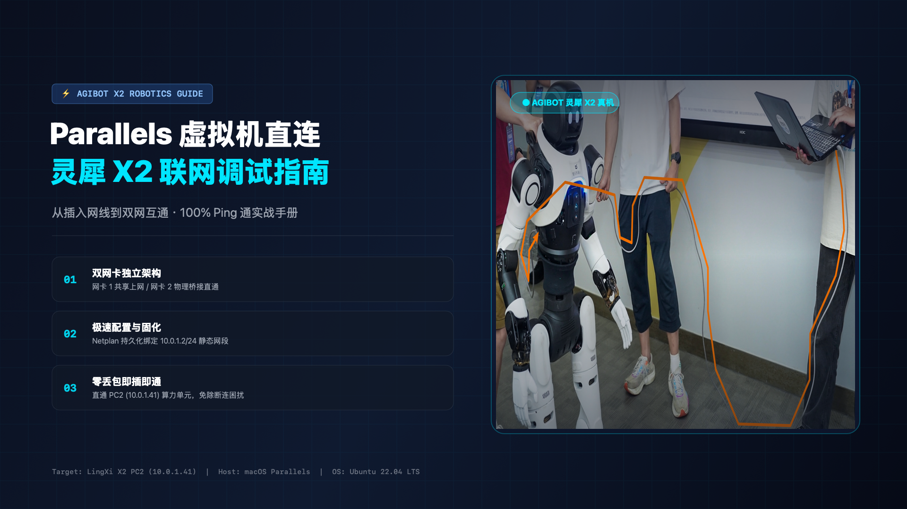
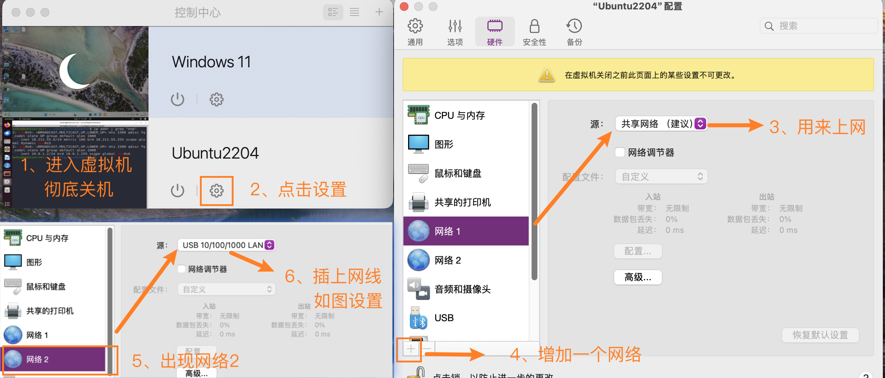
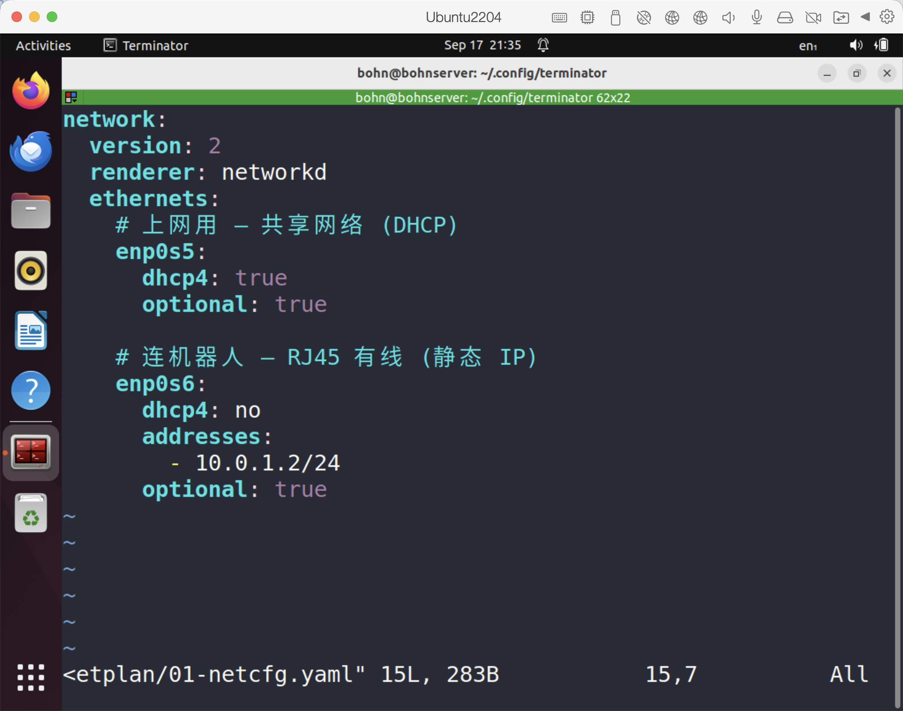
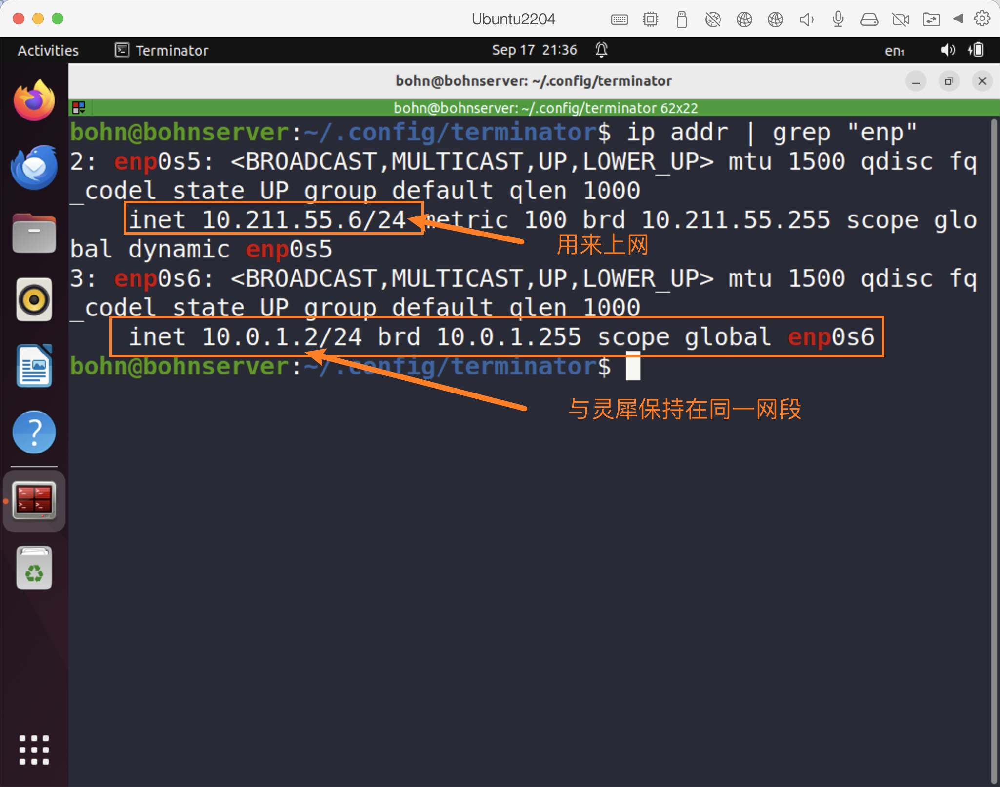

# 使用 Mac 的Parallels Ubuntu 虚拟机直连灵犀 X2 实操指导手册（双网卡图文版）



本文档指导如何在运行于 Mac（Apple Silicon 或 Intel）的 Parallels Desktop 虚拟机中的 Ubuntu 系统，通过双网卡配置实现：**网卡 1 负责虚拟机正常访问互联网，网卡 2 桥接直连灵犀 X2 机器人的调试网线接口**，完成从插拔网线到稳定 `ping` 通的完整配置。

---

## 目录
- [一、 硬件连接与 IP 规划](#一-硬件连接与-ip-规划)
- [二、 Parallels Desktop 双网卡配置（核心步骤）](#二-parallels-desktop-双网卡配置核心步骤)
- [三、 Ubuntu 虚拟机内部双网卡配置](#三-ubuntu-虚拟机内部双网卡配置)
- [四、 连通性测试与验证（Ping 通机器人）](#四-连通性测试与验证ping-通机器人)
- [五、 常见排错指南（Troubleshooting）](#五-常见排错指南troubleshooting)

---

## 一、 硬件连接与 IP 规划

### 1.1 硬件物理连接链路
1. 将 **USB/Type-C 外接网卡** 插入 Mac 电脑的 Type-C/USB 接口。
2. 将 **RJ45 网线** 一头插入电脑上的外接网卡，另一头插入 **灵犀 X2 机身上的调试网线接口**。
3. 启动灵犀。


```
+------------------+         RJ45 网线         +-----------------------------+
|    Mac 电脑      |==========================>|         灵犀 X2             |
| [外接 USB 网卡]  |                           |     [机身调试网线接口]       |
+--------+---------+                           +--------------+--------------+
         |                                                    |
         v (桥接绑定)                                         v
+------------------+                                   +-------------+
|  Ubuntu 虚拟机   |                                   |  PC2 计算单元|
| 网卡2 (enp0s6)   |  --- Ping (10.0.1.0/24 直连) ---> | 10.0.1.41   |
| 10.0.1.2         |                                   +-------------+
+------------------+
```

### 1.2 网络参数规划矩阵

| 设备 / 节点 | 接口 / 角色 | 推荐 IP 地址 | 子网掩码 | 作用说明 |
| :--- | :--- | :--- | :--- | :--- |
| **灵犀 X2 (PC2)** | 机器人调试网线接口 | `10.0.1.41` | `255.255.255.0` (`/24`) | 机器人二次开发计算单元（Jetson Orin NX / RK3588） |
| **灵犀 X2 (PC1)** | 运控单元 | `10.0.1.40` | `255.255.255.0` (`/24`) | **注意**：运控专用核心单元，**严禁**占用或修改 |
| **Ubuntu 虚拟机** | 网卡 1 (如 `enp0s5`) | DHCP 自动获取 | 视虚拟网段而定 | 负责虚拟机访问外部互联网（安装依赖、拉取代码） |
| **Ubuntu 虚拟机** | 网卡 2 (如 `enp0s6`) | `10.0.1.2` | `255.255.255.0` (`/24`) | 负责与灵犀 X2 调试网线接口直连通信 |

---

## 二、 Parallels Desktop 双网卡配置（核心步骤）

为了让 Ubuntu 既能正常上网，又能与灵犀 X2 局域网直连，我们需要在 Parallels Desktop 中配置**两块虚拟网卡**。

### 步骤 1：确认「网络 1」负责上网（共享网络）
1. 在 Mac 上打开 Parallels Desktop，找到 Ubuntu 虚拟机。
2. 进入虚拟机的 **「配置」**（点击齿轮图标） $\rightarrow$ 切换到 **「硬件」** 标签页。
3. 点击左侧列表中的 **「网络 1」**（或默认的网络适配器）：
   - **来源**：选择 **「共享网络 (推荐)」**（Shared Network）。
   - **状态**：勾选 **「已连接」**。

---

### 步骤 2：添加并配置「网络 2」（桥接外接网卡）
1. 在同一个「硬件」配置界面左下角，点击 **`+`** 按钮，选择添加 **「网络」**。
2. 此时左侧会出现 **「网络 2」**。
3. 选中 **「网络 2」**，进行如下关键设置：
   - **来源**：选择 **「桥接网络」**（Bridged Network）。
   - **下拉列表中选择具体硬件**：展开下拉菜单，选中连接到灵犀 X2 的 **物理 USB 网卡**（例如显示为 `USB 10/100/1000 LAN`、`AX88179A` 或 `Apple USB Ethernet Adapter`）。
   - **状态**：勾选 **「已连接」**。

> ⚠️ **致命避坑提示**：
> 「网络 2」**绝不能**再选择“共享网络”！若选了共享网络，虚拟机将处于独立内部 NAT 子网中，无法将二层 ARP/ICMP 数据帧发送到物理网线中，会导致彻底 Ping 不通。



---

## 三、 Ubuntu 虚拟机内部双网卡配置

启动 Ubuntu 虚拟机，打开终端进行网络配置。

### 步骤 1：查看并识别双网卡名称
在终端输入以下命令查看网卡状态：

```bash
ip -br link
```
或
```bash
ip addr
```

**典型输出示例**：
```text
lo               UNKNOWN        127.0.0.1/8 ::1/128
enp0s5           UP             10.211.55.7/24 ...       # 网卡 1：共享网络，已有 DHCP 获取的外网 IP
enp0s6           DOWN/UP        (无 IP 地址)             # 网卡 2：桥接网卡，用于连接灵犀 X2
```
- 通常 `enp0s5` 是上网网卡（已有外网 DHCP 地址）。
- 通常 `enp0s6` 是直连机器人的网卡（未配置 IP，可能显示 `DOWN`）。

---

### 步骤 2：配置持久化静态 IP（Netplan 方案）
通过 Netplan 将静态 IP 固化，确保虚拟机重启后依然生效。

1. 查找或编辑 Netplan 配置文件（Ubuntu 22.04 / 20.04 位于 `/etc/netplan/`）：
   ```bash
   sudo vim /etc/netplan/01-netcfg.yaml
   # 或
   sudo vim /etc/netplan/00-installer-config.yaml
   ```

2. 写入如下配置内容（注意缩进对齐，使用空格，严禁使用 Tab）：

   ```yaml
   network:
     version: 2
     renderer: networkd
     ethernets:
       enp0s5:
         dhcp4: true
         optional: true
       enp0s6:
         dhcp4: no
         addresses:
           - 10.0.1.2/24
         optional: true
   ```

   > ⚠️ **关键要点说明**：
   > - `enp0s5` 保持 `dhcp4: true`，负责自动获得外网网关和 DNS。
   > - `enp0s6` 配置固定静态 IP `10.0.1.2/24`。
   > - **`enp0s6` 绝对不能配置 `gateway4` 或默认路由！** 否则外网路由会被抢占，导致虚拟机无法上网。

3. 保存并退出编辑器（Nano 中按 `Ctrl+O` 保存，回车确认，`Ctrl+X` 退出）。

4. 应用网络配置：
   ```bash
   sudo netplan apply
   ```



---

## 四、 连通性测试与验证（Ping 通机器人）

### 步骤 1：确认网卡 2 IP 分配成功
执行以下命令检查 `enp0s6`：

```bash
ip addr show enp0s6
```

**成功输出预期**：
```text
3: enp0s6: <BROADCAST,MULTICAST,UP,LOWER_UP> mtu 1500 qdisc fq_codel state UP ...
    inet 10.0.1.2/24 brd 10.0.1.255 scope global enp0s6
```
确认包含 `inet 10.0.1.2/24` 且状态为 `state UP`。



---

### 步骤 2：测试 Ping 通灵犀 X2（PC2 计算单元）
执行 ping 命令检测与机器人的连通性：

```bash
ping -c 4 10.0.1.41
```

**成功输出示例**：
```text
PING 10.0.1.41 (10.0.1.41) 56(84) bytes of data.
64 bytes from 10.0.1.41: icmp_seq=1 ttl=64 time=0.824 ms
64 bytes from 10.0.1.41: icmp_seq=2 ttl=64 time=0.612 ms
64 bytes from 10.0.1.41: icmp_seq=3 ttl=64 time=0.589 ms
64 bytes from 10.0.1.41: icmp_seq=4 ttl=64 time=0.601 ms

--- 10.0.1.41 ping statistics ---
4 packets transmitted, 4 received, 0% packet loss, time 3045ms
rtt min/avg/max/mdev = 0.589/0.656/0.824/0.098 ms
```
当出现 `64 bytes from 10.0.1.41` 且 `0% packet loss` 时，说明**Ubuntu 虚拟机与灵犀 X2 已成功打通局域网**！


---

### 步骤 3：验证外网连通性
测试虚拟机访问外网是否正常（确保双网共存）：

```bash
ping -c 2 baidu.com
```
如果外网也能顺利连通，说明双网卡配置完美工作，互不冲突。

---

## 五、 常见排错指南（Troubleshooting）

### 故障 1：执行 Ping 时提示 `Destination Host Unreachable`
- **表现**：
  ```text
  From 10.0.1.2 icmp_seq=1 Destination Host Unreachable
  ```
- **排查步骤**：
  1. **检查物理链路**：外接网卡指示灯是否常亮或闪烁？网线是否插紧在灵犀 X2 的调试网线接口上？
  2. **检查机器人是否已开机完成**：灵犀 X2 启动需要一定时间，确认算力板已正常运行。
  3. **检查 Parallels 网卡 2 绑定**：确认 Parallels 的「网络 2」不是“共享网络”，并且桥接绑定的确实是那张物理外接网卡。
  4. **ARP 扫描排查**：在 Ubuntu 终端运行 `sudo arp-scan --interface=enp0s6 10.0.1.0/24`，如果完全扫不到任何 MAC 地址，说明物理链路或 Parallels 桥接未通。

---

### 故障 2：能 Ping 通机器人，但 Ubuntu 虚拟机无法访问外网
- **表现**：`ping 10.0.1.41` 正常，但 `ping baidu.com` 或 `apt update` 失败。
- **原因**：Netplan 中可能给 `enp0s6` 设置了网关（如 `gateway4: 10.0.1.1`），覆盖了外网默认路由。
- **修复**：
  1. 打开 `/etc/netplan/01-netcfg.yaml`，确保 `enp0s6` 下**只有** `addresses: [10.0.1.2/24]`，删除任何 `gateway4` 或 `routes` 默认路由字段。
  2. 重新执行 `sudo netplan apply`。
  3. 查看路由表验证：`ip route`，确保 `default via ... dev enp0s5` 指向的是网卡 1。

---

### 故障 3：重新插拔网线后突然 Ping 不通
- **表现**：拔出网线或拔下外接网卡再插回后，状态变成卡住或无法 Ping 通。
- **原因**：部分外接网卡热插拔后接口状态变为 `DOWN` 或 IP 掉线。
- **快速恢复命令**：
  ```bash
  sudo ip link set enp0s6 up
  sudo ip addr add 10.0.1.2/24 dev enp0s6 2>/dev/null
  ping 10.0.1.41 -c 2
  ```
- 若经常需要热插拔，可执行 `sudo netplan apply` 重新应用配置。
